[TOC]

# Docker

### 什么是Docker

[Docker官网](https://www.docker.com/) [Docker源码](https://github.com/docker/docker-ce)

* Docker 是一个开源的应用容器引擎，基于 [Go 语言](https://www.runoob.com/go/go-tutorial.html) 并遵从 Apache2.0 协议开源。
* Docker 可以让开发者打包他们的应用以及依赖包到一个轻量级、可移植的容器中，然后发布到任何流行的 Linux /Windows机器上，也可以实现虚拟化。
* 容器是完全使用沙箱机制，相互之间不会有任何接口（类似 iPhone 的 app）,更重要的是容器性能开销极低。

#### Docker公司

Docker 公司位于旧金山，由法裔美籍开发者和企业家 Solumon Hykes 创立，标志如下：


Docker 公司起初是一家名为 dotCloud 的平台即服务（Platform-as-a-Service, PaaS）提供商。底层技术上，dotCloud 平台利用了 Linux 容器技术。为了方便创建和管理这些容器，dotCloud 开发了一套内部工具，之后被命名为“Docker”。Docker就是这样诞生的！

2013年，dotCloud 的 PaaS 业务并不景气，公司需要寻求新的突破。于是他们聘请了 Ben Golub 作为新的 CEO，将公司重命名为“Docker”，放弃dotCloud PaaS 平台，怀揣着“将 Docker 和容器技术推向全世界”的使命，开启了一段新的征程。

如今 Docker 公司被普遍认为是一家创新型科技公司，据说其市场价值约为 10 亿美元。Docker 公司已经通过多轮融资，吸纳了来自硅谷的几家风投公司的累计超过 2.4 亿美元的投资。

几乎所有的融资都发生在公司更名为“Docker”之后。

> “Docker”一词来自英国口语，意为码头工人（Dock Worker），即从船上装卸货物的人。

多数技术人员在谈到 Docker 时，主要是指 Docker 引擎。Docker 引擎主要有两个版本：企业版（EE）和社区版（CE）。每个季度，企业版和社区版都会发布一个稳定版本。社区版本会提供 4 个月的支持，而企业版本会提供 12 个月的支持。社区版还会通过 Edge 方式发布月度版。

从 2017 年第一季度开始，Docker 版本号遵循 YY.MM-xx 格式，类似于 Ubuntu 等项目。例如，2018 年 6 月第一次发布的社区版本为 18.06.0-ce。

### Docker的应用场景

- Web 应用的自动化打包和发布。
- 自动化测试和持续集成、发布。
- 在服务型环境中部署和调整数据库或其他的后台应用。
- 从头编译或者扩展现有的 OpenShift 或 Cloud Foundry 平台来搭建自己的 PaaS 环境。

### Docker的应用背景

#### 1. 腾讯在Docker上的应用


[腾讯万台规模的 Docker 应用实践](https://www.infoq.cn/article/tencent-millions-scale-docker-application-practice)

#### 2. 京东在Docker上的应用


[京东 618：15 万个 Docker 实例，所有业务全部容器化](https://www.infoq.cn/article/2016/06/jd-618-docker-cloud-practice)

#### 3. 阿里在Docker上的应用


[集团AliDocker化双11总结](https://developer.aliyun.com/article/68461)

#### 4. 容器技术调研报告


[2016中国容器技术调研报告全景解读](https://developer.aliyun.com/article/64791)

### Docker系统的架构

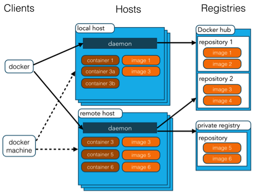

Docker 包括三个基本概念:

- **镜像（Image）**：Docker 镜像（Image），就相当于是一个 root 文件系统。比如官方镜像 ubuntu:16.04 就包含了完整的一套 Ubuntu16.04 最小系统的 root 文件系统。
- **容器（Container）**：镜像（Image）和容器（Container）的关系，就像是面向对象程序设计中的类和实例一样，镜像是静态的定义，容器是镜像运行时的实体。容器可以被创建、启动、停止、删除、暂停等。
- **仓库（Repository）**：仓库可看成一个代码控制中心，用来保存镜像。

Docker 使用客户端-服务器 (C/S) 架构模式，使用远程API来管理和创建Docker容器。

Docker 容器通过 Docker 镜像来创建。

容器与镜像的关系类似于面向对象编程中的对象与类。

| 概念                   | 说明                                                         |
| ---------------------- | ------------------------------------------------------------ |
| Docker 镜像(Images)    | Docker 镜像是用于创建 Docker 容器的模板，比如 Ubuntu 系统。  |
| Docker 容器(Container) | 容器是独立运行的一个或一组应用，是镜像运行时的实体。         |
| Docker 客户端(Client)  | Docker 客户端通过命令行或者其他工具使用 Docker SDK (https://docs.docker.com/develop/sdk/) 与 Docker 的守护进程通信。 |
| Docker 主机(Host)      | 一个物理或者虚拟的机器用于执行 Docker 守护进程和容器。       |
| Docker Registry        | Docker 仓库用来保存镜像，可以理解为代码控制中的代码仓库。Docker Hub([https://hub.docker.com](https://hub.docker.com/)) 提供了庞大的镜像集合供使用。一个 Docker Registry 中可以包含多个仓库（Repository）；每个仓库可以包含多个标签（Tag）；每个标签对应一个镜像。通常，一个仓库会包含同一个软件不同版本的镜像，而标签就常用于对应该软件的各个版本。我们可以通过 **<仓库名>:<标签>** 的格式来指定具体是这个软件哪个版本的镜像。如果不给出标签，将以 **latest** 作为默认标签。 |
| Docker Machine         | Docker Machine是一个简化Docker安装的命令行工具，通过一个简单的命令行即可在相应的平台上安装Docker，比如VirtualBox、 Digital Ocean、Microsoft Azure。 |


### Docker支持的系统和架构

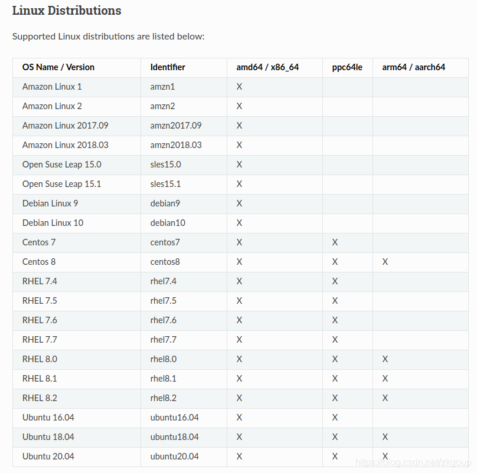

Docker 实质上是在已经运行的 Linux 下制造了一个隔离的文件环境，因此它执行的效率几乎等同于所部署的 Linux 主机。

因此，Docker 必须部署在 Linux 内核的系统上。如果其他系统想部署 Docker 就必须安装一个虚拟 Linux 环境。

Docker Desktop 是 Docker 在 Windows 10 和 macOS 操作系统上的官方安装方式，这个方法依然属于先在虚拟机中安装 Linux 然后再安装 Docker 的方法。

Docker Desktop 官方下载地址： https://hub.docker.com/editions/community/docker-ce-desktop-windows


### Docker和虚拟机的区别

![1.png]()

Docker 属于 Linux 容器的一种封装，提供简单易用的容器使用接口。它是目前最流行的 Linux 容器解决方案。

### 区别：

| 特性       | 容器               | 虚拟机       |
| ---------- | ------------------ | ------------ |
| 启动       | 秒级               | 分钟级       |
| 硬盘使用   | 一般为MB           | 一般为GB     |
| 性能       | 接近原生           | 弱于         |
| 系统支持量 | 单机支持上千个容器 | 一般是几十个 |


### 虚拟机的安装

本例使用的虚拟机软件为VirtualBox，操作系统为CentOS7。我们需要安装虚拟机。

#### 1. VirtualBox


[VirtualBox下载地址](https://www.virtualbox.org/wiki/Downloads)


需要下载Windows hosts版本

虚拟机安装的时候注意**配置2块网卡**


#### 2. 下载CentOS7


[CentOS7下载地址](https://mirrors.tuna.tsinghua.edu.cn/centos/7.9.2009/isos/x86_64/)


#### 3. 安装Linux

##### 新建虚拟机


按照以下要求安装

创建新的虚拟机

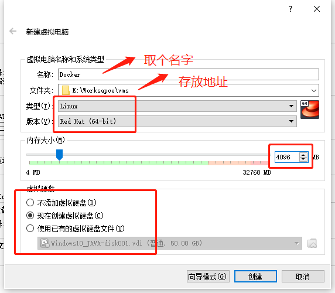

创建虚拟硬盘

建议大小为20GB

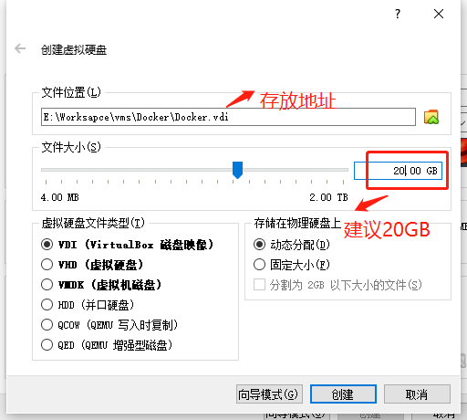


##### 加载安装光盘

选择刚才创建的Docker， **右键** 打开设置


进入设置中选择**存储**


按照上图进行设置。接下来选择CentOS-2009版本的镜像文件

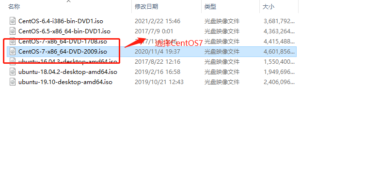

也可以设置**系统**中的**处理器**勾选启用**嵌套VT-x/AMD-V**的硬件虚拟选项，可以加快虚拟机速度。


选择启动，开始安装


##### 安装系统


回车，开始安装。


选择使用中文进行安装。


选择安装模式：可以点选该按钮选择安装的模式


如果对命令行不熟悉的同学可以选择使用图形化界面。**本例使用GNOME图形界面来减少同学们对于Linux的陌生感**。


设置安装位置


设置后点**完成**


进入网络和主机名，对主机名称进行设置


修改主机名为dockerpc，并**点选按钮，打开网络连接**。


设置好后点选完成即可。


点击**开始安装**进行安装，并对root密码进行设置


设置root密码


重启系统即可


如果系统提示**未接受许可证**，可进入勾选同意即可。


##### 系统设置

选择语言：汉语


选择输入法


隐私选项可以取消勾选


时区选择北京中国


在线账号，选择跳过


设置用户名称


设置密码，注意密码的要求：大小写和数字


安装完成，开始使用


#### 4. 使用CentOS7

##### 安装增强功能

安装增强功能可以使我们对虚拟机的控制更简单，比如可以无缝切换虚拟机鼠标和主机鼠标，互相拷贝文件等。

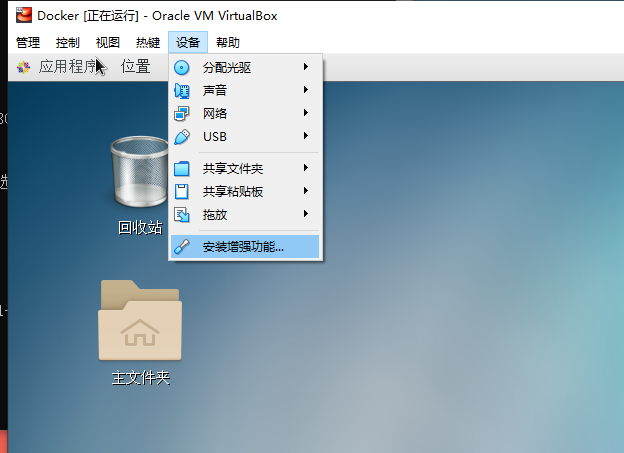

点击运行

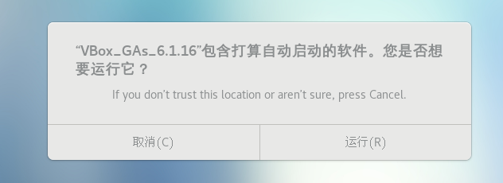

安装成功，窗口中回车即可。

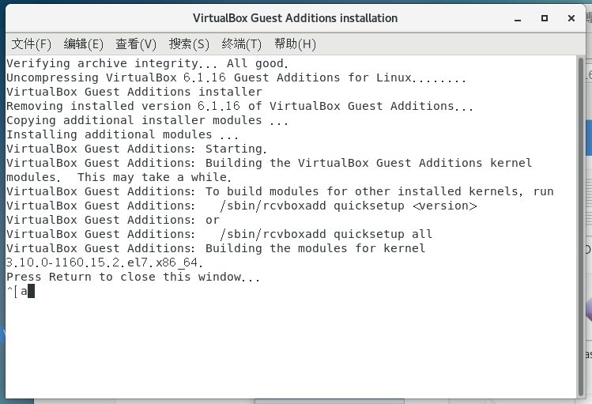

如果出现如下的失败可以使用如下命令，执行完后再重新安装

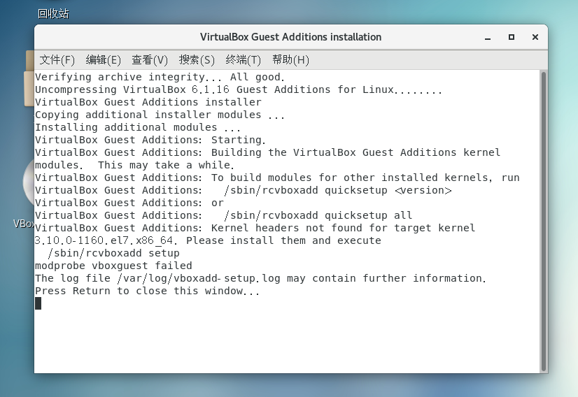


```shell
yum update
yum install gcc
yum install gcc-c++
yum install make
yum install kernel-headers
yum install kernel-devel
```

这几个安装命令需要一点时间。


##### 分辨率

设置分辨率，


在系统工具-设置中，选择**设备**，选择Displays，根据自己的需求设置分辨率即可。


##### 使用终端

* 右键，选择打开终端

Linux中大多数命令都在终端中执行，进入终端可以如下两种方式：


* 应用程序 -> 系统工具 -> 终端

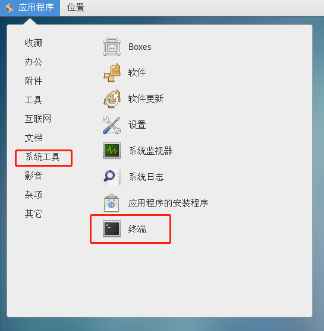


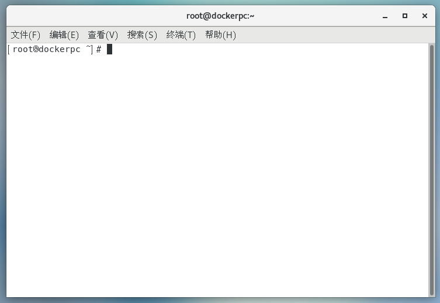


##### 网络设置

由于采用了**NAT模式**，在VirtualBox中，该模式可以具有如下特点

1. 如果主机可以上网，虚拟机可以上网

2. 虚拟机之间不能ping通

3. 虚拟机可以ping通主机（此时ping虚拟机的网关，即是ping主机）

4. 主机不能ping通虚拟机

该模式的特点就是**无法在主机端ping通虚拟机**，如果需要主机和虚拟机都可以ping通，需要使用**桥接**模式。

桥接模式有如下特点：

1. 如果主机可以上网，虚拟机可以上网

2. 虚拟机之间可以ping通

3. 虚拟机可以ping通主机

4. **主机可以ping通虚拟机**

   以上各点基于一个前提：主机可以上网

5. 如果主机不可以上网，所有1-4特点均无

###### 设置桥接网卡

关闭系统，进入系统设置，新增虚拟网卡2，并设置桥接模式。


###### 设置固定IP

重启系统，设置网卡为固定IP地址。Docker需要服务器为固定IP地址。

新建的网卡为enp0s8，进行设置


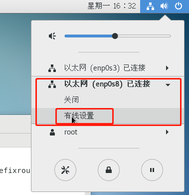

设置参数


可以使用

```bash
#查看ip地址
ip a

#查看网关地址
netstat -rn
```

根据刚才的查询，设置静态的地址如下


重启网络或者重启系统即可。

```shell
#重启网络
service network restart

#或者重启系统,重启命令reboot
reboot
```

##### 使用配置文件配置网络

###### CentOS7网络配置相关文件

* /etc/resolv.conf             # DNS配置文件
* /etc/hosts                      #主机名到IP地址的映射 ,不该主机名基本不会动
* /etc/sysconfig/network           #所有的网络接口和路由信息，网关只有最后一个有效。
* /etc/sysconfig/network-script/ifcfg-<interface-name>      #每一个网络接口的配置信


###### 修改配置文件

配置文件存放在/etc/sysconfig/network-script/ifcfg-enp0s8z中

典型配置文件如下：

```shell
cat ifcfg-enp0s8

TYPE="Ethernet"
PROXY_METHOD="none"
BROWSER_ONLY="no"
BOOTPROTO="static"
IPADDR="192.168.56.101"
NETMASK="255.255.255.0"
NETWORK="192.168.56.0"
GATEWAY="192.168.56.1"
DEFROUTE="yes"
IPV4_FAILURE_FATAL="no"
IPV6INIT="yes"
IPV6_AUTOCONF="yes"
IPV6_DEFROUTE="yes"
IPV6_FAILURE_FATAL="no"
IPV6_ADDR_GEN_MODE="stable-privacy"
NAME="enp0s8"
DEVICE="enp0s8"
ONBOOT="yes"
```

- TYPE=Ethernet               # 网卡类型：为以太网
- PROXY_METHOD=none           # 代理方式：关闭状态
- BROWSER_ONLY=no             # 只是浏览器：否
- BOOTPROTO=dhcp              # 网卡的引导协议：DHCP[中文名称: 动态主机配置协议]
- DEFROUTE=yes                # 默认路由：是
- IPADDR="192.168.56.101"  #IP地址
- NETMASK="255.255.255.0" #掩码
- NETWORK="192.168.56.0"  # 网段
- GATEWAY="192.168.56.1" # 网关
- IPV4_FAILURE_FATAL=no       # 是不开启IPV4致命错误检测：否
- IPV6INIT=yes                # IPV6是否自动初始化: 是[不会有任何影响, 现在还没用到IPV6]
- IPV6_AUTOCONF=yes           # IPV6是否自动配置：是[不会有任何影响, 现在还没用到IPV6]
- IPV6_DEFROUTE=yes           # IPV6是否可以为默认路由：是[不会有任何影响, 现在还没用到IPV6]
- IPV6_FAILURE_FATAL=no       # 是不开启IPV6致命错误检测：否
- IPV6_ADDR_GEN_MODE=stable-privacy           # IPV6地址生成模型：stable-privacy [这只一种生成IPV6的策略]
- NAME=enp0s8            # 网络接口名称，即配置文件名后半部分。
- UUID=f47bde51-fa78-4f79-b68f-d5dd90cfc698   # 通用唯一识别码, 每一个网卡都会有, 不能重复, 否两台linux只有一台网卡可用，**可以不填**。
- DEVICE=enp0s8    # 网卡设备名称
- ONBOOT=yes                   # 是否开机启动， 要想网卡开机就启动或通过 `systemctl restart network`控制网卡,必须设置为 `yes` 

###### 重启网络

```shell
service network restart

systemctl restart network
```

#### Linux简介

* Linux内核最初只是由芬兰人李纳斯·托瓦兹（Linus Torvalds）在赫尔辛基大学上学时出于个人爱好而编写的
* 免费，开源，可自由分享
* 支持多线程、多cpu
* 支持多任务、多用户操作
* 基于时间片任务式的调度


#### 常用Linux操作系统

* RedHat  ：[RedHat](https://www.redhat.com/zh)
* CentOS  ：RedHat的社区版 [CentOS](https://www.centos.org/)

* Ubuntu  ：[Ubuntu](https://ubuntu.com/)
* DeepIn : [DeepIn](https://www.deepin.com/) 做的比较好的国产Linux
* 其他：Debian/Fedora/SuSE/OpenSuSE/TurboLinux/BluePoint/红旗/startOS


#### Linux系统中的常用文件夹

Linux和Windows在逻辑管理上的逻辑不同，Windows采用驱动盘的方式，而Linux是基于root/的挂载机制，就像一棵树。

* /：根路径，最顶级路径。
* /bin：binary（二进制）的缩写，放着最常使用的命令。
* /boot：启动的核心文件，包括连接文件和镜像文件。
* /dev：device（设备）的缩写，存放Linux的外部设备，在Linux中访问设备的方式和访问文件的方式相同。
* /etc：主要用来存放配置文件和子目录。
* /home：用户的主目录，在Linux中，每个用户都已一个自己的home目录，以自己帐号名来命名。
* /lib：存放Linux操作系统需要用到的动态链接库，类似与Windows中的dll文件。
* /lost+find：非法关机的时候会存放一些文件，平时是空的。
* /media：u盘、光驱等，自动检测后会挂载在这个文件夹下。
* /opt：给主机额外安装软件的时候准备的。
* /tmp：临时文件。
* /usr：用户安装的程序，一般会存放在这个文件夹中。
* /usr/bin：系统用户使用的应用程序。
* /usr/sbin：超级用户使用的比较高级的管理程序和系统守护程序。
* /usr/src：内核源代码

#### Linux系统常用命令

##### ls

常用来显示目录列表，其后可以携带参数：

```shell
ls -al
```

* -a ：全部的文件，连同隐藏文件( 开头为 . 的文件) 一起列出来(常用)

* -d ：仅列出目录本身，而不是列出目录内的文件数据(常用)

* -l ：长数据串列出，包含文件的属性与权限等等数据；(常用)

##### cd

用来变换工作目录的命令

* 相对地址：

```shell
cd /usr/local
```

* 绝对地址

```shell
cd usr
```

在使用中多注意相对地址和绝对地址的使用

使用 `..` 来代表父级目录，`.`来代表当前目录

```shell
# 切换到上级目录
cd ..
```

##### mkdir

创建文件夹，可使用参数

* -m ：配置文件的权限喔！直接配置，不需要看默认权限 (umask) 的限制

* -p ：帮助你直接将所需要的目录(包含上一级目录)递归创建起来！

```shell
mkdir -m 711 dir1
```

###### 711

使用数字来标识权限，

* 读：4
* 写：2
* 运行：1

读+写+运行=7，读+写=6，读+执行=5，写+运行=3

另外，使用三个8进制数字分别代表 拥有者，所在组用户，其他组用户（u，g，o表示User、Group、及Other）

所以711代表：用户可以进行读写执行，所在组用户可以执行，其他组可以执行

##### rmdir

删除非公目录。注意：该命令要求文件夹必须为空，如果不为空，则无法删除。

```shell
rmdir -p welcome
```

* -p : 连同上一级目录也一起删除

##### cp

拷贝文件（copy）

* -a：相当於 -pdr 的意思，至於 pdr 请参考下列说明；(常用)

* -d：若来源档为连结档的属性(link file)，则复制连结档属性而非文件本身；

* -f：为强制(force)的意思，若目标文件已经存在且无法开启，则移除后再尝试一次；

* -i：若目标档(destination)已经存在时，在覆盖时会先询问动作的进行(常用)

* -l：进行硬式连结(hard link)的连结档创建，而非复制文件本身；

* -p：连同文件的属性一起复制过去，而非使用默认属性(备份常用)；

* -r：递归持续复制，用於目录的复制行为；(常用)

* -s：复制成为符号连结档 (symbolic link)，亦即『捷径』文件；

symbolic link（软连接），类似于快捷方式。

```shell
# 为f1创建一个叫f3的软连接
ln -s f1 f3
```

示例

```shell
# 拷贝home目录下的.bashrc目录到/tmp/bashrc中，并让用户确认。
cp -i ~/.bashrc /tmp/bashrc
```

##### rm

删除文件，也可以是目录

* -f ：就是 force 的意思，忽略不存在的文件，不会出现警告信息；

* -i ：互动模式，在删除前会询问使用者是否动作

* -r ：递归删除啊！非常危险的选项！！

```shell
# 删除文件夹 /temp/abc
rm -i /temp/abc

# 删除abc文件夹及其中的文件
rm -rf /temp/abc

# 删库跑路,很危险，不要使用。也不要尝试。
rm -rf /
```

##### mv

移动文件，也可以用来给文件或者目录改名字。

* -f ：force 强制的意思，如果目标文件已经存在，不会询问而直接覆盖；

* -i ：若目标文件 (destination) 已经存在时，就会询问是否覆盖！

* -u ：若目标文件已经存在，且 source 比较新，才会升级 (update)

```shell
# 将tom改名为jerry，要求jerry文件夹不存在
mv tom jerry
# 将tom文件移动到jerry目录下。
mv tom jerry/
```

##### touch

创建文件

```shell
touch a.txt
```

##### cat

查看文件

```shell
cat a.txt
```

#### Vi工具

详细请参考：[Linux vi/vim](https://www.runoob.com/linux/linux-vim.html)

vi是Linux的文本编辑工具，vim是其发展出来的另外一个文本编辑器。在程序员中被广泛使用。

[vim](https://www.vim.org/) 定义自己就是一个程序开发工具，不是一般的文本编辑器。

 vi/vim 共分为三种模式，分别是**命令模式（Command mode）**，**输入模式（Insert mode）**和**底线命令模式（Last line mode）**

##### 命令模式：

用户刚刚启动 vi/vim，便进入了命令模式。

此状态下敲击键盘动作会被Vim识别为命令，而非输入字符。比如我们此时按下i，并不会输入一个字符，i被当作了一个命令。

以下是常用的几个命令：

- **i** 切换到输入模式，以输入字符。
- **x** 删除当前光标所在处的字符。
- **:** 切换到底线命令模式，以在最底一行输入命令。

若想要编辑文本：启动Vim，进入了命令模式，按下i，切换到输入模式。

命令模式只有一些最基本的命令，因此仍要依靠底线命令模式输入更多命令。

##### 输入模式

在命令模式下按下i就进入了输入模式。

在输入模式中，可以使用以下按键：

- **字符按键以及Shift组合**，输入字符
- **ENTER**，回车键，换行
- **BACK SPACE**，退格键，删除光标前一个字符
- **DEL**，删除键，删除光标后一个字符
- **方向键**，在文本中移动光标
- **HOME**/**END**，移动光标到行首/行尾
- **Page Up**/**Page Down**，上/下翻页
- **Insert**，切换光标为输入/替换模式，光标将变成竖线/下划线
- **ESC**，退出输入模式，切换到命令模式

##### 底线命令模式

在命令模式下按下:（英文冒号）就进入了底线命令模式。

底线命令模式可以输入单个或多个字符的命令，可用的命令非常多。

在底线命令模式中，基本的命令有（已经省略了冒号）：

- q 退出程序
- w 保存文件

按ESC键可随时退出底线命令模式。


### Docker安装环境的准备

我们提供的CentOS2009版本默认环境就支持Docker，可以跳过该步骤。

#### 查看内核版本

安装docker之前需要确认环境。登录Linux系统，在命令行输入如下命令确认内核大于3.10

```shell
#查看系统内核
uname -r

#查看系统版本
cat /etc/os-release

[root@cos2009 ~]# cat /etc/os-release
NAME="CentOS Linux"
VERSION="7 (Core)"
ID="centos"
ID_LIKE="rhel fedora"
VERSION_ID="7"
PRETTY_NAME="CentOS Linux 7 (Core)"
ANSI_COLOR="0;31"
CPE_NAME="cpe:/o:centos:centos:7"
HOME_URL="https://www.centos.org/"
BUG_REPORT_URL="https://bugs.centos.org/"

CENTOS_MANTISBT_PROJECT="CentOS-7"
CENTOS_MANTISBT_PROJECT_VERSION="7"
REDHAT_SUPPORT_PRODUCT="centos"
REDHAT_SUPPORT_PRODUCT_VERSION="7"
```

适用于Ubuntu，Debian,Centos等大部分Linux。

其他系统环境需求可参考 [安装指南](http://get.daocloud.io/#install-docker)

#### 升级内核版本

如果您的内核版本达不到3.10，则需要升级。在CentOS7中，我们升级内核采用以下的命令。

1. 更新yum源仓库

```shell
$ yum -y update
```

2. 启用ELRepo仓库

ELRepo 仓库是基于社区的用于企业级 Linux 仓库，提供对 RedHat Enterprise (RHEL) 和 其他基于 RHEL的 Linux 发行版（CentOS、Scientific、Fedora 等）的支持。
ELRepo 聚焦于和硬件相关的软件包，包括文件系统驱动、显卡驱动、网络驱动、声卡驱动和摄像头驱动等。

```shell
# 导入ELRepo仓库的公共密钥
rpm --import https://www.elrepo.org/RPM-GPG-KEY-elrepo.org

# 安装ELRepo仓库的yum源
rpm -Uvh http://www.elrepo.org/elrepo-release-7.0-3.el7.elrepo.noarch.rpm
```

#### 查看可用的系统内核包

```shell
yum --disablerepo="*" --enablerepo="elrepo-kernel" list available
```

#### 安装最新版本内核

其中**kernel-ml**为上一步查询到的内核版本名称

```shell
$ yum --enablerepo=elrepo-kernel install kernel-ml
```

#### 设置 grub2

grub2是Linux用来启动系统的引导选项。

内核安装好后，需要设置为默认启动选项并重启后才会生效

```shell
$ sudo awk -F\' '$1=="menuentry " {print i++ " : " $2}' /etc/grub2.cfg
0 : CentOS Linux (4.18.7-1.el7.elrepo.x86_64) 7 (Core)
1 : CentOS Linux (3.10.0-862.11.6.el7.x86_64) 7 (Core)
2 : CentOS Linux (3.10.0-514.el7.x86_64) 7 (Core)
```

使用 `grub2-set-default 0` 命令设置

```shell
grub2-set-default 0
```

#### 验证

```shell
uname -r
```

### CentOS7安装Docker

* Docker只支持64位系统，所以CentOS7需要64位才可以。
* Docker要求内核的版本高于3.10，可以使用下面的命令查看

```shell
#查看linux的内核，需要大于3.10
uname -r

3.10.0-1160.el7.x86_64
```

#### 使用命令安装Docker

使用root权限的用户登录才可以安装

```shell
#使用yum安装docker
yum -y update
yum -y install docker

#查看docker的版本
docker version

Client:
 Version:         1.13.1
 API version:     1.26
 Package version: docker-1.13.1-203.git0be3e21.el7.centos.x86_64
 Go version:      go1.10.3
 Git commit:      0be3e21/1.13.1
 Built:           Thu Nov 12 15:11:46 2020
 OS/Arch:         linux/amd64

Server:
 Version:         1.13.1
 API version:     1.26 (minimum version 1.12)
 Package version: docker-1.13.1-203.git0be3e21.el7.centos.x86_64
 Go version:      go1.10.3
 Git commit:      0be3e21/1.13.1
 Built:           Thu Nov 12 15:11:46 2020
 OS/Arch:         linux/amd64
 Experimental:    false

#运行helloworld测试
docker run hello-world

Unable to find image 'hello-world:latest' locally
Trying to pull repository docker.io/library/hello-world ... 
latest: Pulling from docker.io/library/hello-world
b8dfde127a29: Pull complete 
Digest: sha256:89b647c604b2a436fc3aa56ab1ec515c26b085ac0c15b0d105bc475be15738fb
Status: Downloaded newer image for docker.io/hello-world:latest

Hello from Docker!
This message shows that your installation appears to be working correctly.

To generate this message, Docker took the following steps:
 1. The Docker client contacted the Docker daemon.
 2. The Docker daemon pulled the "hello-world" image from the Docker Hub.
    (amd64)
 3. The Docker daemon created a new container from that image which runs the
    executable that produces the output you are currently reading.
 4. The Docker daemon streamed that output to the Docker client, which sent it
    to your terminal.

To try something more ambitious, you can run an Ubuntu container with:
 $ docker run -it ubuntu bash

Share images, automate workflows, and more with a free Docker ID:
 https://hub.docker.com/

For more examples and ideas, visit:
 https://docs.docker.com/get-started/

```

* docker version可以用来查看docker的版本号
* docker run可以用来运行docker的镜像，如果在本地的镜像库中无法找到镜像，则docker会从服务器中寻找并下载该镜像，进行容器话，然后运行该容器。

#### 使用脚本安装Docker

使用该命令，可以安装最新版本的Docker。但该版本有可能过于到无法安装成功的问题。主要的原因是特殊情况，网络访问不到。可以参照以下阿里云的方法进行安装。

使用root权限的用户登录才可以安装

```shell
curl -sSL https://get.daocloud.io/docker | sh
```

#### 使用阿里云安装Docker

有时候，受到网络的影响，我们可能没有正常的安装Docker，如果不能安装，请使用以下方法安装Docker

```shell
# step 1: 安装必要的一些系统工具
sudo yum install -y yum-utils device-mapper-persistent-data lvm2

# Step 2: 添加软件源信息
sudo yum-config-manager --add-repo http://mirrors.aliyun.com/docker-ce/linux/centos/docker-ce.repo

# Step 3: 更新并安装 Docker-CE
sudo yum makecache fast
sudo yum -y install docker-ce

# Step 4: 开启Docker服务
sudo service docker start
```


#### 启动Docker服务

使用root权限的用户登录

```shell
#查看docker是否运行
service docker status

Redirecting to /bin/systemctl status docker.service
● docker.service - Docker Application Container Engine
   Loaded: loaded (/usr/lib/systemd/system/docker.service; disabled; vendor preset: disabled)
   Active: active (running) since 二 2021-03-09 10:40:00 CST; 21min ago
     Docs: http://docs.docker.com
 Main PID: 27697 (dockerd-current)
    Tasks: 29
   Memory: 8.8M
   CGroup: /system.slice/docker.service
           ├─27697 /usr/bin/dockerd-current --add-runtime docker-runc=/usr/libexec/docker/docker-runc-current --default-...
           └─27705 /usr/bin/docker-containerd-current -l unix:///var/run/docker/libcontainerd/docker-containerd.sock --m...

3月 09 10:40:51 cos2009 dockerd-current[27697]: To try something more ambitious, you can run an Ubuntu container with:
3月 09 10:40:51 cos2009 dockerd-current[27697]:  $ docker run -it ubuntu bash
3月 09 10:40:51 cos2009 dockerd-current[27697]: 
3月 09 10:40:51 cos2009 dockerd-current[27697]: Share images, automate workflows, and more with a free Docker ID:
3月 09 10:40:51 cos2009 dockerd-current[27697]:  https://hub.docker.com/
3月 09 10:40:51 cos2009 dockerd-current[27697]: 
3月 09 10:40:51 cos2009 dockerd-current[27697]: For more examples and ideas, visit:
3月 09 10:40:51 cos2009 dockerd-current[27697]:  https://docs.docker.com/get-started/
3月 09 10:40:51 cos2009 dockerd-current[27697]: 
3月 09 10:40:51 cos2009 dockerd-current[27697]: time="2021-03-09T10:40:51.653913237+08:00" level=warning msg="86e3...ment"
Hint: Some lines were ellipsized, use -l to show in full.

#启动docker服务,下面两个命令任选其一。
service docker start
systemctl start docker


#设置docker为开机自启动
systemctl enable docker
```

* service docker status可以用来查看当前docker守护进程是否运行
* service docker start用来启动当前的docker守护进程
* 如果希望docker在启动的时候自动启动，可以使用systemctl denable docker

#### 查看docker信息

使用`docker info`命令查看当前docker容器的信息

```shell
#查看docker信息
docker info

Containers: 0
 Running: 0
 Paused: 0
 Stopped: 0
Images: 0
Server Version: 1.13.1
Storage Driver: overlay2
 Backing Filesystem: xfs
 Supports d_type: true
 Native Overlay Diff: true
Logging Driver: journald
Cgroup Driver: systemd
Plugins: 
 Volume: local
 Network: bridge host macvlan null overlay
Swarm: inactive
Runtimes: docker-runc runc
Default Runtime: docker-runc
Init Binary: /usr/libexec/docker/docker-init-current
containerd version:  (expected: aa8187dbd3b7ad67d8e5e3a15115d3eef43a7ed1)
runc version: 66aedde759f33c190954815fb765eedc1d782dd9 (expected: 9df8b306d01f59d3a8029be411de015b7304dd8f)
init version: fec3683b971d9c3ef73f284f176672c44b448662 (expected: 949e6facb77383876aeff8a6944dde66b3089574)
Security Options:
 seccomp
  WARNING: You're not using the default seccomp profile
  Profile: /etc/docker/seccomp.json
 selinux
Kernel Version: 3.10.0-1160.el7.x86_64
Operating System: CentOS Linux 7 (Core)
OSType: linux
Architecture: x86_64
Number of Docker Hooks: 3
CPUs: 4
Total Memory: 3.7 GiB
Name: cos2009
ID: 6UZ5:KOPO:6RXJ:V2BU:NADU:P2BU:DJMD:EWCY:MYYA:ODFC:FYDE:ZUA4
Docker Root Dir: /var/lib/docker
Debug Mode (client): false
Debug Mode (server): false
Registry: https://index.docker.io/v1/
Experimental: false
Insecure Registries:
 127.0.0.0/8
Live Restore Enabled: false
Registries: docker.io (secure)
```

#### 使用docker帮助

```shell
# 显示docker的帮助
docker --help

Usage:	docker COMMAND

A self-sufficient runtime for containers

Options:
      --config string      Location of client config files (default "/root/.docker")
  -D, --debug              Enable debug mode
      --help               Print usage
  -H, --host list          Daemon socket(s) to connect to (default [])
  -l, --log-level string   Set the logging level ("debug", "info", "warn", "error", "fatal") (default "info")
      --tls                Use TLS; implied by --tlsverify
      --tlscacert string   Trust certs signed only by this CA (default "/root/.docker/ca.pem")
      --tlscert string     Path to TLS certificate file (default "/root/.docker/cert.pem")
      --tlskey string      Path to TLS key file (default "/root/.docker/key.pem")
      --tlsverify          Use TLS and verify the remote
  -v, --version            Print version information and quit

Management Commands:
  container   Manage containers
  image       Manage images
  network     Manage networks
  node        Manage Swarm nodes
  plugin      Manage plugins
  secret      Manage Docker secrets
  service     Manage services
  stack       Manage Docker stacks
  swarm       Manage Swarm
  system      Manage Docker
  volume      Manage volumes

Commands:
  attach      Attach to a running container
  build       Build an image from a Dockerfile
  commit      Create a new image from a container's changes
  cp          Copy files/folders between a container and the local filesystem
  create      Create a new container
  diff        Inspect changes on a container's filesystem
  events      Get real time events from the server
  exec        Run a command in a running container
  export      Export a container's filesystem as a tar archive
  history     Show the history of an image
  images      List images
  import      Import the contents from a tarball to create a filesystem image
  info        Display system-wide information
  inspect     Return low-level information on Docker objects
  kill        Kill one or more running containers
  load        Load an image from a tar archive or STDIN
  login       Log in to a Docker registry
  logout      Log out from a Docker registry
  logs        Fetch the logs of a container
  pause       Pause all processes within one or more containers
  port        List port mappings or a specific mapping for the container
  ps          List containers
  pull        Pull an image or a repository from a registry
  push        Push an image or a repository to a registry
  rename      Rename a container
  restart     Restart one or more containers
  rm          Remove one or more containers
  rmi         Remove one or more images
  run         Run a command in a new container
  save        Save one or more images to a tar archive (streamed to STDOUT by default)
  search      Search the Docker Hub for images
  start       Start one or more stopped containers
  stats       Display a live stream of container(s) resource usage statistics
  stop        Stop one or more running containers
  tag         Create a tag TARGET_IMAGE that refers to SOURCE_IMAGE
  top         Display the running processes of a container
  unpause     Unpause all processes within one or more containers
  update      Update configuration of one or more containers
  version     Show the Docker version information
  wait        Block until one or more containers stop, then print their exit codes

Run 'docker COMMAND --help' for more information on a command.


# 针对docker的某个命令参数显示对应帮助
docker start --help

Usage:	docker start [OPTIONS] CONTAINER [CONTAINER...]

Start one or more stopped containers

Options:
  -a, --attach               Attach STDOUT/STDERR and forward signals
      --detach-keys string   Override the key sequence for detaching a container
      --help                 Print usage
  -i, --interactive          Attach container's STDIN
```

#### 安装docker后无法上网的问题

编辑虚拟机中的文件

```shell
vi /etc/sysctl.conf
#添加以下配置
net.ipv4.ip_forward=1
#重启服务
systemctl restart network
#查看是否修改成功
sysctl net.ipv4.ip_forward
```


#### 查看docker帮助文档

使用`--help`参数来获取对应docker命令的帮助文档。

```shell
docker --help

docker image --help
```

### Windows10安装Docker

[Windows Docker 安装](https://www.runoob.com/docker/windows-docker-install.html)


### Docker镜像加速

国内从 Docker Hub 拉取镜像有时会遇到困难，此时可以配置镜像加速器。国内很多云服务商都提供了国内加速器服务，例如：

* 阿里：需要登录阿里开发账号，右侧镜像中心 -> 镜像加速器 -> 复制地址)
* 网易：https://hub-mirror.c.163.com
* 百度：https://mirror.baidubce.com

#### 添加阿里Registry（可选）

```shell
#安装yum-utils
yum install -y yum-utils
#配置阿里镜像资源
sudo yum-config-manager --add-repo http://mirrors.aliyun.com/docker-ce/linux/centos/docker-ce.repo
```

除了添加阿里的库以外还需要**注册和登录阿里的账号**，设置阿里云的加速器才行。

```shell
# 创建文件夹 /etc/docker
sudo mkdir -p /etc/docker
# 创建daemon.json文件。也可以使用touch或者vi来创建。
sudo tee /etc/docker/daemon.json <<-'EOF'
# xxxx为阿里分配给你docker镜像地址
{
  "registry-mirrors": ["https://xxxxx.mirror.aliyuncs.com"]
}
EOF
sudo systemctl daemon-reload
sudo systemctl restart docker
```

请参考以下链接来进行设置

[使用阿里云为docker镜像加速](https://yq.aliyun.com/articles/653045/?scm=20140722.184.2.173)

#### 添加网易云/百度云加速器

网易公有镜像中心不需要登录就可以使用。

一样是在/etc/docker/daemon.json文件中加入修改如下配置，该配置将同时添加网易云和百度云进行加速。

```json
{
  "registry-mirrors": [
    "https://hub-mirror.c.163.com",
    "https://mirror.baidubce.com"
  ]
}
```

添加后记得重启Docker

```shell
sudo systemctl daemon-reload
sudo systemctl restart docker
```


### Docker的常用命令

#### 查看Docker是否正常工作

docker info命令用于查询环境中docker程序是否存在，功能是否正常。该命令会返回

* 所有的容器和镜像的数量
* Docker使用的执行驱动和存储驱动
* Docker的 基本配置

```shell
docker info

Containers: 36
 Running: 0
 Paused: 0
 Stopped: 36
Images: 15
Server Version: 1.13.1
Storage Driver: overlay2
 Backing Filesystem: xfs
 Supports d_type: true
 Native Overlay Diff: true
Logging Driver: journald
Cgroup Driver: systemd
Plugins: 
 Volume: local
 Network: bridge host macvlan null overlay
Swarm: inactive
Runtimes: docker-runc runc
Default Runtime: docker-runc
Init Binary: /usr/libexec/docker/docker-init-current
containerd version:  (expected: aa8187dbd3b7ad67d8e5e3a15115d3eef43a7ed1)
runc version: 66aedde759f33c190954815fb765eedc1d782dd9 (expected: 9df8b306d01f59d3a8029be411de015b7304dd8f)
init version: fec3683b971d9c3ef73f284f176672c44b448662 (expected: 949e6facb77383876aeff8a6944dde66b3089574)
Security Options:
 seccomp
  WARNING: You're not using the default seccomp profile
  Profile: /etc/docker/seccomp.json
 selinux
Kernel Version: 3.10.0-1160.el7.x86_64
Operating System: CentOS Linux 7 (Core)
OSType: linux
Architecture: x86_64
Number of Docker Hooks: 3
CPUs: 4
Total Memory: 3.7 GiB
Name: cos2009
ID: X6OH:AZ66:RKHY:ZTPC:LALB:M3NJ:J2M4:ZWGR:4ISH:D5WD:LCGZ:ZFWE
Docker Root Dir: /var/lib/docker
Debug Mode (client): false
Debug Mode (server): false
Registry: https://index.docker.io/v1/
Experimental: false
Insecure Registries:
 127.0.0.0/8
Live Restore Enabled: false
Registries: docker.io (secure)

```

#### 1. 启动第一个Docker

##### docker run

docker run：包含创建和运行两个指令。

* 我们使用docker run命令来创建一个容器，可以使用docker run --help来查看所有的参数。

```shell
#启动第一个docker，运行ubuntu，使用交互模式-i，启动一个虚拟终端连接该系统-t，并执行bin/bash命令

#随后docker会检查本地时候有ubuntu这个镜像，如果没有，那么docker会连接官方维护的Docker Hub Registry来查看其中是否有镜像，然后便会下载ubuntu镜像，并保存到本地，并用该镜像来创建一个新的容器
#该容器为ubuntu操作系统，拥有自己的网络和IP地址，以及一个用来和宿主主机进行通信的桥接网络接口。然后我们告诉docker在新容器中要运行bash命令。
docker run -i -t ubuntu /bin/bash

#在进入了ubuntu容器以后，可以使用hostname来测试该ubuntu系统
hostname
#查看虚拟主机的hosts配置
cat /etc/hosts
#尝试在ubuntu容器中安装vim工具
apt-get update && apt-get install vim

#你可以继续在容器中进行各种事情，如果想要退出当前容器，可以使用如下命令：
exit

# 查看docker run命令的帮助
docker run --help

Usage:	docker run [OPTIONS] IMAGE [COMMAND] [ARG...]

Run a command in a new container

Options:
      --add-host list                         Add a custom host-to-IP mapping (host:ip) (default [])
  -a, --attach list                           Attach to STDIN, STDOUT or STDERR (default [])
      --blkio-weight uint16                   Block IO (relative weight), between 10 and 1000, or 0 to disable (default 0)
      --blkio-weight-device weighted-device   Block IO weight (relative device weight) (default [])
      --cap-add list                          Add Linux capabilities (default [])
      --cap-drop list                         Drop Linux capabilities (default [])
      --cgroup-parent string                  Optional parent cgroup for the container
      --cidfile string                        Write the container ID to the file
      --cpu-count int                         CPU count (Windows only)
      --cpu-percent int                       CPU percent (Windows only)
      --cpu-period int                        Limit CPU CFS (Completely Fair Scheduler) period
      --cpu-quota int                         Limit CPU CFS (Completely Fair Scheduler) quota
      --cpu-rt-period int                     Limit CPU real-time period in microseconds
      --cpu-rt-runtime int                    Limit CPU real-time runtime in microseconds
  -c, --cpu-shares int                        CPU shares (relative weight)
      --cpus decimal                          Number of CPUs (default 0.000)
      --cpuset-cpus string                    CPUs in which to allow execution (0-3, 0,1)
      --cpuset-mems string                    MEMs in which to allow execution (0-3, 0,1)
      --credentialspec string                 Credential spec for managed service account (Windows only)
  -d, --detach                                Run container in background and print container ID
      --detach-keys string                    Override the key sequence for detaching a container
      --device list                           Add a host device to the container (default [])
      --device-read-bps throttled-device      Limit read rate (bytes per second) from a device (default [])
      --device-read-iops throttled-device     Limit read rate (IO per second) from a device (default [])
      --device-write-bps throttled-device     Limit write rate (bytes per second) to a device (default [])
      --device-write-iops throttled-device    Limit write rate (IO per second) to a device (default [])
      --disable-content-trust                 Skip image verification (default true)
      --dns list                              Set custom DNS servers (default [])
      --dns-option list                       Set DNS options (default [])
      --dns-search list                       Set custom DNS search domains (default [])
      --entrypoint string                     Overwrite the default ENTRYPOINT of the image
  -e, --env list                              Set environment variables (default [])
      --env-file list                         Read in a file of environment variables (default [])
      --expose list                           Expose a port or a range of ports (default [])
      --group-add list                        Add additional groups to join (default [])
      --health-cmd string                     Command to run to check health
      --health-interval duration              Time between running the check (ns|us|ms|s|m|h) (default 0s)
      --health-retries int                    Consecutive failures needed to report unhealthy
      --health-timeout duration               Maximum time to allow one check to run (ns|us|ms|s|m|h) (default 0s)
      --help                                  Print usage
  -h, --hostname string                       Container host name
      --init                                  Run an init inside the container that forwards signals and reaps processes
      --init-path string                      Path to the docker-init binary
  -i, --interactive                           Keep STDIN open even if not attached
      --io-maxbandwidth string                Maximum IO bandwidth limit for the system drive (Windows only)
      --io-maxiops uint                       Maximum IOps limit for the system drive (Windows only)
      --ip string                             Container IPv4 address (e.g. 172.30.100.104)
      --ip6 string                            Container IPv6 address (e.g. 2001:db8::33)
      --ipc string                            IPC namespace to use
      --isolation string                      Container isolation technology
      --kernel-memory string                  Kernel memory limit
  -l, --label list                            Set meta data on a container (default [])
      --label-file list                       Read in a line delimited file of labels (default [])
      --link list                             Add link to another container (default [])
      --link-local-ip list                    Container IPv4/IPv6 link-local addresses (default [])
      --log-driver string                     Logging driver for the container
      --log-opt list                          Log driver options (default [])
      --mac-address string                    Container MAC address (e.g. 92:d0:c6:0a:29:33)
  -m, --memory string                         Memory limit
      --memory-reservation string             Memory soft limit
      --memory-swap string                    Swap limit equal to memory plus swap: '-1' to enable unlimited swap
      --memory-swappiness int                 Tune container memory swappiness (0 to 100) (default -1)
      --name string                           Assign a name to the container
      --network string                        Connect a container to a network (default "default")
      --network-alias list                    Add network-scoped alias for the container (default [])
      --no-healthcheck                        Disable any container-specified HEALTHCHECK
      --oom-kill-disable                      Disable OOM Killer
      --oom-score-adj int                     Tune host's OOM preferences (-1000 to 1000)
      --pid string                            PID namespace to use
      --pids-limit int                        Tune container pids limit (set -1 for unlimited)
      --privileged                            Give extended privileges to this container
  -p, --publish list                          Publish a container's port(s) to the host (default [])
  -P, --publish-all                           Publish all exposed ports to random ports
      --read-only                             Mount the container's root filesystem as read only
      --restart string                        Restart policy to apply when a container exits (default "no")
      --rm                                    Automatically remove the container when it exits
      --runtime string                        Runtime to use for this container
      --security-opt list                     Security Options (default [])
      --shm-size string                       Size of /dev/shm, default value is 64MB
      --sig-proxy                             Proxy received signals to the process (default true)
      --stop-signal string                    Signal to stop a container, SIGTERM by default (default "SIGTERM")
      --stop-timeout int                      Timeout (in seconds) to stop a container
      --storage-opt list                      Storage driver options for the container (default [])
      --sysctl map                            Sysctl options (default map[])
      --tmpfs list                            Mount a tmpfs directory (default [])
  -t, --tty                                   Allocate a pseudo-TTY
      --ulimit ulimit                         Ulimit options (default [])
  -u, --user string                           Username or UID (format: <name|uid>[:<group|gid>])
      --userns string                         User namespace to use
      --uts string                            UTS namespace to use
  -v, --volume list                           Bind mount a volume (default [])
      --volume-driver string                  Optional volume driver for the container
      --volumes-from list                     Mount volumes from the specified container(s) (default [])
  -w, --workdir string                        Working directory inside the container


# 也可以使用man命令来查看docker-run
man docker-run
```

* -i：保持STDIN输入是打开的
* -t：启用一个伪tty终端

**同时启用 -i -t参数可以在容器运行的时候，提供一个可交互的shell。而不是运行一个后台的服务器。**

##### docker ps

```shell
#正常情况下，我们使用docker ps只能看到当前正在运行中的所有容器信息
docker ps
```

如果想看到所有已经关闭的容器信息，可以使用参数-a

```shell
#查看当前系统中容器的列表，-a代表列出所有容器，包含正在运行的和已经停止的。
docker ps -a
```


* CONTAINER ID：容器ID
* IMAGE：容器镜像
* COMMAND：执行的命令
* CREATED：创建时间
* STATUS：当前状态
* PORTS：映射端口
* NAMES：容器名字，如果没有指定，系统会自动命名

**三种方法可以指代唯一容器**

1. 短ID：6071e53ff9ea
2. 长ID：
3. 容器名字：elated_dubinsky

可以使用命令docker inspect来查看容器的长ID，如：

```shell
#检视容器66896的信息
docker inspect bb896

#检视容器66896的信息，只看Id
docker inspect bb896 | grep Id
```


#### 2. 给容器命名

使用如下命令将再次创建一个基于ubuntu镜像的容器，并为该容器取名为：my_docker_ubuntu。

```shell
docker run --name my_docker_ubuntu -i -t ubuntu /bin/bash
```

* 上述命令将会创建一个名为my_docker_ubuntu的容器。
* 一个合法的容器名称只能包含以下字符：小写字母a~z、大写字母A~Z、数字0~9、下划线、圆点、横线（如果用正则表达式来表示这些符号，就是[a-zA-Z0-9_．一］）
* 在很多Docker命令中，我们都可以用容器的名称来替代容器ID
* 容器的命名必须是唯一的。如果我们试图创建两个名称相同的容器，则命令将会失败。如果要使用的容器名称已经存在，可以先用`docker rm`命令删除已有的同名容器后，再来创建新的容器。

#### 3. 重新启动停止的容器

```shell
#使用名字启动容器
docker start my_docker_ubuntu

#除了使用名字启动，我们也可以使用id来启动容器
docker start 6071e53ff9ea

#直接启动容器，并使用终端登录
docker start -i 6071353ff9ea

#查看当前正在运行的docker容器
docker ps 
```

如果想要在容器启动的时候，启用STDIN输入，可以使用参数 **-i**。

#### 4. 附着到容器上

Docker容器重新启动的时候，会沿用docker run命令时指定的参数来运行，因此我们容器重新启动后会运行过一个交互式会话shell。此外，我们也可以 用docker attach命令重新附着到该容器的会话上。

```shell
#使用名字附着
docker attach my_docker_ubuntu

#使用id附着
docker attach 6071353ff9ea
```

这样，我们就又能重新回到容器的Bash提示符。

**如果退出容器shell，容器将会随之停止运行。**

#### 5. 创建后台容器

后台容器，也成为守护式容器，没有交互式会话，非常适合运行应用程序和服务。大多数时候，我们都需要以守护式方式来运行我们的服务器。

```shell
#使用-d参数在后台启用一个守护式容器
#我们还在容器里要运行的命令里使用了一个while循环，该循环会一直打印hello world，直到容器或其进程停止运行。
docker run --name my_docker_ubuntu_daemon -d ubuntu /bin/sh -c "while true;do echo hello world;sleep 1;done"

#查看当前容器
docker ps -a
```


#### 6. 查看容器内日志

##### docker logs

```shell
#可以使用docker logs命令来获取容器的日志，日志将显示不断输出的hello world
docker logs my_docker_ubuntu_daemon

#使用docker logs -f参数来监控docker日志，该命令与tail -f命令相似，可以使用ctrl+c退出日志跟踪。
docker logs -f my_docker_ubuntu_daemon
```

##### docker top

```shell
#查看容器内的进程
docker top my_docker_ubuntu_daemon
```

#### 7. 在容器内部运行进程

在Docker1.3之后，可以使用docker exec命令在容器内部额外启动新进程。该进程可以是后台任务或者是交互式任务。

```shell
#在容器my_docker_ubuntu_daemon中/etc目录中创建一个文件new_config_file
docker exec -d my_docker_ubuntu_daemon touch /etc/new_config_file

#在容器my_docker_ubuntu_daemon中启动一个shell交互式任务
docker exec -it my_docker_ubuntu_daemon /bin/bash

#进入容器后，可以查看刚才创建的new_config_file文件
cat /etc/new_config_file
```

#### 8. 停止容器

```shell
#通过名字停止容器
docker stop my_docker_ubuntu_daemon
#通过id停止容器
docker stop 493bb4a22d65
```

#### 9. 自动重启容器

```shell
#可以使用--restart标志，让docker自动重新启动容器。
docker run --restart=always --name my_docker_ubuntu_daemon -d ubuntu /bin/sh "while true;do echo hello world;sleep 1;done"
#可以设置--restart=on-failure:5来设置失败后可以重启5次。
```

#### 10. 删除容器

```shell
#删除my_docker_ubuntu_daemon容器
docker rm my_docker_ubuntu_daemon

#目前还没有办法一次删除所有容器，但是可以通过下面的方法来删除所有容器。
docker rm 'docker ps -a -q'
```

#### 11. 示例：创建Nginx服务器

在本例中，我们将使用Alpine（阿尔卑斯）来替换Ubuntu作为我们的基础操作系统。

##### Alpine Linux

一个面向安全的轻型的Linux发行版。Alpine Linux采用了 [musl libc](http://musl-libc.org/) 和 [busybox](http://busybox.net/)以减小系统的体积和运行时资源消耗。

在保持瘦身的同时，Alpine Linux还提供了自己的包管理工具apk。

**关键的是，相比于其他Linux的Docker镜像，它的容量非常小，仅仅只有5MB。**


[官网](https://alpinelinux.org/posts/Alpine-3.8.0-released.html)

##### Nginx


*Nginx* (engine x) 是一个高性能的[HTTP](https://baike.baidu.com/item/HTTP)和[反向代理](https://baike.baidu.com/item/反向代理/7793488)web服务器，同时也提供了IMAP/POP3/SMTP服务。Nginx是由伊戈尔·赛索耶夫为[俄罗斯](https://baike.baidu.com/item/俄罗斯/125568)访问量第二的Rambler.ru站点（俄文：Рамблер）开发的，第一个公开版本0.1.0发布于2004年10月4日。

Nginx 可以在大多数 [Unix](https://baike.baidu.com/item/Unix) Linux OS 上编译运行，并有 [Windows](https://baike.baidu.com/item/Windows) 移植版。

[官网](http://nginx.org/)

##### 构建方法一

```shell
# 运行alpine容器
docker run -it --name myalpine -p 80:80 alpine

# 备份原先的库配置文件
cp /etc/apk/repositories /etc/apk/repositories.bak

# 修改原来的库文件为阿里服务器
vi /etc/apk/repositories
# 修改内容：
http://mirrors.aliyun.com/alpine/v3.11/main
http://mirrors.aliyun.com/alpine/v3.11/community

# 切换到/usr/local文件夹
cd /usr/local

# 下载nginx代码包
wget http://nginx.org/download/nginx-1.16.1.tar.gz

Connecting to nginx.org (52.58.199.22:80)
saving to 'nginx-1.16.1.tar.gz'
nginx-1.16.1.tar.gz  100% |************************************************************************************************************| 1008k  0:00:00 ETA
'nginx-1.16.1.tar.gz' saved

# 解压缩
tar -xzvf nginx-1.16.1.tar.gz

# 更新软件，并安装编译需要用到的软件
apk update && apk add  iotop  gcc libgcc libc-dev libcurl libc-utils pcre-dev  zlib-dev  libnfs make  pcre pcre2 zip unzip net-tools pstree wget libevent libevent-dev iproute2

# 进入到nginx-1.16.1文件夹
cd nginx-1.16.1

# 编译并安装nginx
./configure  --prefix=/apps/nginx && make && make install && ln -sv /apps/nginx/sbin/nginx  /usr/bin/

# 为nginx添加用户和组
addgroup  -g 2019 -S nginx && adduser  -s /sbin/nologin -S -D  -u 2019 -G nginx nginx

# 启动nginx,并在浏览器中访问
nginx

# 从容器中封装镜像，其中07d98efa88c4为容器的id。该id可以使用docker ps -a查询到。
docker commit 07d98efa88c4 mynewalpine

# 重新运行mynewalpine镜像，并加入80端口映射
docker run -d --name a2 -p 80:80 mynewalpine nginx "-g daemon off;"

# 查看当前运行的容器
docker ps 

# 使用浏览器进行访问
```


##### 构建方法二

使用官方镜像文件


在docker hub中查找nginx

```shell
# 下载镜像
docker pull nginx

# 使用下载的镜像创建容器，并映射端口80，命令为mynginx，启用一个交互终端运行bash shell
docker run --name mynginx -d -p 80:80 nginx

# 在容器内部运行进程，启动一个新的终端
docker exec -it b02ff /bin/bash

# docker hub中，nginx使用的系统为debian。
# 可以查看/etc/issue来查看
root@b02ff143556a:/# cat /etc/issue
Debian GNU/Linux 10 \n \l

# 执行更新
apt-get update
# 安装vim
apt-get install vim

# 编辑index.html文件
vim /usr/share/nginx/index.html

# 修改后保存文件，直接在浏览器中进行访问即可。

```


### Docker镜像和仓库

#### 1. 什么是镜像


Docker的镜像是由文件系统叠加而成。最底端是一个引导文件系统，即**bootfs**，类似与Linux上的引导文件系统。**rootfs**文件系统在Docker里，永远只能是只读状态，并且利用Docker联合加载技术（**union mount**）在root文件系统层上加载更多的只读文件系统。联合加载会将各层文件系统叠加在一起，这样最终的文件系统会包含所有底层的文件和目录。

Docker将这样的文件系统称为镜像。一个镜像可以放到另外一个镜像的顶部。位于下面的镜像被称为“**父镜像（parent image）**”，以此类推，最底部的景象称为“**基础镜像（base image）**”。最后，当从一个镜像启动容器时，Docker会在该镜像的最顶层加载一个读写文件系统。我们运行的程序就是在这个读写层中执行的。

当Docker第一次启动一个容器时，初始的读写层是空的。当文件系统发生变化时，这些变化都会应用到这一层上。比如，如果想修改一个文件，这个文件首先会从该读写层下面的只读层复制到该读写层。该文件的只读版本依然存在，但是已经被读写层中的该文件副本所隐藏。

通常这种机制被称为**写时复制**（copy on write）。当创建一个新容器时，Docker会构建一个镜像栈，并在栈的最顶端添加一个读写层。在这个读写层再加上其下面的镜像层以及一些配置数据，就构成一个容器。


#### 2. 列出镜像

```shell
#列出本机所有镜像，本机的所有镜像都保存在/var/lib/docker目录下。每个镜像保存在Docker所采用的存储驱动目录下面，如aufs或者devicemapper。也可以在/var/lib/docker/containers目录下面看到所有容器。

[root@cos2009 ~]# docker images
REPOSITORY                                                                    TAG                 IMAGE ID            CREATED             SIZE
mynginx                                                                       latest              85ccd4ce18d2        14 hours ago        184 MB
mynewalpine                                                                   latest              568c2364965a        9 days ago          215 MB
docker.io/alpine                                                              latest              49f356fa4513        11 days ago         5.61 MB
docker.io/nginx                                                               latest              7ce4f91ef623        12 days ago         133 MB
hello-node                                                                    v1                  7c5b5c59c2c6        2 months ago        655 MB
registry.cn-hangzhou.aliyuncs.com/google_containers/kube-proxy                v1.20.2             43154ddb57a8        2 months ago        118 MB
registry.cn-hangzhou.aliyuncs.com/google_containers/kube-controller-manager   v1.20.2             a27166429d98        2 months ago        116 MB
registry.cn-hangzhou.aliyuncs.com/google_containers/kube-apiserver            v1.20.2             a8c2fdb8bf76        2 months ago        122 MB
registry.cn-hangzhou.aliyuncs.com/google_containers/kube-scheduler            v1.20.2             ed2c44fbdd78        2 months ago        46.4 MB
registry.cn-hangzhou.aliyuncs.com/google_containers/dashboard                 v2.1.0              9a07b5b4bfac        4 months ago        226 MB
registry.cn-hangzhou.aliyuncs.com/google_containers/storage-provisioner       v4                  85069258b98a        4 months ago        29.7 MB
registry.cn-hangzhou.aliyuncs.com/google_containers/etcd                      3.4.13-0            0369cf4303ff        7 months ago        253 MB
registry.cn-hangzhou.aliyuncs.com/google_containers/coredns                   1.7.0               bfe3a36ebd25        9 months ago        45.2 MB
registry.cn-hangzhou.aliyuncs.com/google_containers/metrics-scraper           v1.0.4              86262685d9ab        12 months ago       36.9 MB
registry.cn-hangzhou.aliyuncs.com/google_containers/pause                     3.2                 80d28bedfe5d        14 months ago       683 kB
docker.io/nginx                                                               1.13                ae513a47849c        2 years ago         109 MB
docker.io/node                                                                6.9.2               faaadb4aaf9b        4 years ago         655 MB


#列出指定的镜像
docker images docker.io/ubuntu

```

所有本地镜像都保存在Docker宿主主机的`/var/lib/docker`目录下。

Docker目前支持五种镜像层次的存储driver：aufs、device mapper、btrfs、vfs、overlay。

所以，本地镜像都存储在对应的镜像层次中，例如：/var/lib/docker/overlay2


**其中repositories.json中记录了镜像文件和id之间的关系**。


所有容器都存放在`var/lib/docker/containers`目录下。


参考：[Docker文件目录](https://www.jianshu.com/p/806485990aea)

##### 示例：如何查看容器镜像

```shell
#　显示镜像信息
docker images

[root@cos2009 overlay2]# docker images
REPOSITORY                                                                    TAG                 IMAGE ID            CREATED             SIZE
mynginx                                                                       latest              85ccd4ce18d2        14 hours ago        184 MB

# 检查镜像的配置参数
docker inspect 85ccd4

```


#### 3. 仓库

镜像都是从仓库（Registry）中下载下来的，默认的Registry是由Docker公司运行的公共Registry服务——Docker Hub。

https://hub.docker.com/search?q=&type=image

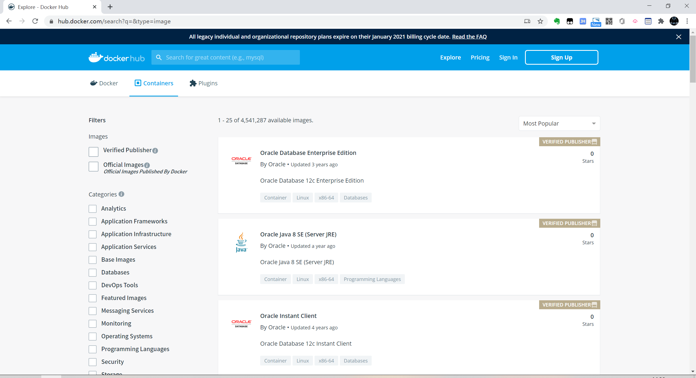

Docker Hub中有两种类型的仓库

* 用户仓库（user repository）：由Docker注册的用户创建
* 顶级仓库（top-level repository）：顶级仓库，由专门的内部人员来管理

**用户仓库命令规则: 用户名/仓库名**，如：docker.io/ubuntu。**每个镜像仓库都可以存放很多镜像**，我们可以通过一种称为**标签（tag）**的功能来进行区分。比如**ubuntu:12.04就代表12.04版本的ubuntu镜像**。


##### 3.1 使用命令行查找镜像

```shell
#查找所有ubuntu镜像
docker search ubuntu
```


**也可以直接在网页中查找**


##### 3.2 拉取镜像

```shell
#拉取镜像ubuntu
docker pull ubuntu

#拉取docker.io的ubuntu镜像
docker pull docker.io/ubuntu

#拉取最新版的ubuntu
docker pull ubuntu:latest

```


#### 4. 构建镜像

* docker commit：将容器构建成镜像
* docker build / dockerfile：使用Dockerfile文件镜像构建

##### 4.1 docker commit

```shell
#使用commit命令构建新的镜像
docker commit 493bb4a22d65 z33/my_ubuntu_vim

#使用inspect命令查看创建的镜像的信息
docker inspect z33/my_ubuntu_vim

#使用history来查看镜像构建信息
docker history z33/my_ubuntu_vim

#从新构建的镜像中运行一个新的容器
docker run -t -i z33/my_ubuntu_vim /bin/bash
```

##### 4.2 docker build / dockerfile

我们也可以使用dockerfile进行构建，输入如下命令来执行如下操作

1. 创建static_web文件夹
2. 进入到static_web文件夹
3. 创建Dockerfile
4. 编辑Dockerfile

```shell
mkdir static_web
cd static_web
touch Dockerfile
vim Dockerfile
```

> 本示例使用vim来编辑Dockerfile文件，你可以通过修改阿里的CentOS7源来加速安装vim

```shell
#安装wget
yum -y install wget
#进入yum目录
cd /etc/yum.repos.d
#备份一下原先的库地址文件
cp CentOS-Base.repo CentOS-Base.repo.bak
#修改源地址为阿里云镜像
wget -O CentOS-Base.repo http://mirrors.aliyun.com/repo/Centos-7.repo
#运行yum makecache生成缓存
yum clean all
yum makecache
#安装vim
yum -y install vim*
```

编写Dockerfile文件如下

```dockerfile
# Version：0.0.1
FROM nginx:latest
MAINTAINER Z33 "pg24@qq.com"
RUN echo 'Hi, Welcome to docker!Use Dockerfile make container!' \ > /usr/share/nginx/html/index.html
EXPOSE 80
```

> Dockerfile使用 **#** 来进行注释


```shell
#使用Dockerfile构建新的镜像，注意命令最后面需要一个. (点)， -t代表设置标签
docker build -t="z33/static_web:0.0.1" .

#如果你的构建文件是放在git上，你也可以从git仓库中的文件来构建新的镜像。该命令了解即可，不用执行。
docker build -t="z33/static_web:0.0.1" \ git@github.com:z33/docker-static_web

```

如果在构建过程中出现错误，那么Docker会停留在最后一个成功的镜像上。在此之前的镜像都会被缓存起来。但修改Dockerfile文件正常后，输入build命令后，会继续从刚才中断的地方继续，这样可以使用刚才缓存的镜像，节约时间。如果不想使用缓存，希望每次构建都从第一布开始，可以使用--no-cache参数。

```shell
docker build --no-cache -t="z33/static_web:0.0.1" .
```

使用docker images查看新创建的镜像

```shell
docker images z33/static_web:0.0.1 
```

如果想深入探求镜像是如何构建出来的，可以使用docker history命令

```shell
docker history z33/static_web:0.0.1
```


##### 4.3 从新的镜像启动容器

* -p：参数可以用来映射容器和宿主主机的端口。第一个参数为宿主主机端口号，第二个参数为容器端口号。
* 可以使用/udp后缀来指定绑定UDP端口
* -P（大写）：使用-P参数来对外公开在Dockerfile中的EXPOSE指令中设置的所有端口

```shell
#运行该镜像容器，并将80端口映射到宿主主机的8080端口。
#参数-d为detached（分离），这种方式非常适合运行类似nginx守护进程这样的需要长时间运行的进程
#-p为端口映射，将容器中的80端口映射到宿主主机的8080端口上。如果没有指定宿主主机上的端口，docker会随机从49153～65535中选取一个用来映射
docker run -d -p 8080:80 --name static_web z33/static_web:0.0.1 \nginx -g "daemon off;"

#参看容器static_web的80端口映射信息
docker static_web:0.0.1 80

#使用-P参数来对外公开在Dockerfile中的EXPOSE指令中设置的所有端口
docker run -d -P --name static_web z33/static_web:0.0.1 \nginx -g "daemon off;"

```

##### 4.4 删除镜像

```shell
docker rmi z33/static_web:0.0.1
```

#### 5. 私有镜像库

有时候我们可能希望构建和存储包含不想被公开的信息或者数据的镜像，这时候我们主要有以下2种选择：

* 利用Docker Hub上的私有仓库
* 运行自己的私有镜像库Registry

##### 5. 1 从容器运行Registry

运行registry并绑定到5000端口，设置为后台运行

```shell
docker run -p 5000:5000 -d registry
```

##### 5.2 将私有镜像推送到Registry

```shell
# 查看镜像的id，以mynginx为例
docker images mynginx

REPOSITORY          TAG                 IMAGE ID            CREATED             SIZE
mynginx             latest              85ccd4ce18d2        15 hours ago        184 MB


# 为mynginx打标签
docker tag 85ccd4 192.168.56.101:5000/mynginx

# docker push 192.168.56.101:5000/mynginx
The push refers to a repository [192.168.56.101:5000/mynginx]
Get https://192.168.56.101:5000/v1/_ping: http: server gave HTTP response to HTTPS client
# 出错了，没有成功
# 出现这问题的原因是：Docker自从1.3.X之后docker registry交互默认使用的是HTTPS，但是搭建私有镜像默认使用的是HTTP服务，所以与私有镜像交时出现以上错误。
# 解决办法是：在docker server启动的时候，增加启动参数，默认使用HTTP访问：

vim /usr/lib/systemd/s ystem/docker.service

# 在ExecStart=/usr/bin/dockerd-current 中加入下面参数 \
# --insecure-registry  ip：5000
# 如下图：
```


```shell
# 重新启动docker和docker的后台服务
systemctl daemon-reload
systemctl restart docker

# 重新启动registry容器

[root@cos2009 overlay2]# docker ps -al
CONTAINER ID        IMAGE               COMMAND                  CREATED             STATUS                      PORTS               NAMES
542c88eb58ee        registry            "/entrypoint.sh /e..."   13 minutes ago      Exited (2) 44 seconds ago                       amazing_kare
[root@cos2009 overlay2]# docker start 542c
542c
[root@cos2009 overlay2]# docker ps
CONTAINER ID        IMAGE               COMMAND                  CREATED             STATUS              PORTS                    NAMES
542c88eb58ee        registry            "/entrypoint.sh /e..."   14 minutes ago      Up 1 second         0.0.0.0:5000->5000/tcp   amazing_kare


# 再次上传镜像
[root@cos2009 overlay2]# docker push 192.168.56.101:5000/mynginx
The push refers to a repository [192.168.56.101:5000/mynginx]
0d9c6c257c04: Pushed 
1914a564711c: Pushed 
db765d5bf9f8: Pushed 
903ae422d007: Pushed 
66f88fdd699b: Pushed 
2ba086d0a00c: Pushed 
346fddbbb0ff: Pushed 
latest: digest: sha256:96c7c28ca8855a8340f12c1379a0eb7f5c86139ca1d8f0438c282fc42ccd4ecb size: 1782
```


##### 5.3 从本地私有镜像运行容器

```shell
docker run -d -p 80:80 --name private_nginx 192.168.56.101:5000/mynginx nginx -g "daemon off;"
```


### Dockerfile中的命令

#### 什么是Dockerfile

Dockerfile使用基本的DSL语句来构建一个Docker镜像。配合docker build命令，可以帮助我们快速的创建镜像。我们推荐使用Dockerfile和docker build命令，而不是使用docker commit来创建镜像。

#### Dockerfile工作结构图


#### 常用Dockerifle命令

##### 1. CMD

用于指定一个容器启动时要运行的命令。该指令有点类似与RUN指令，区别在于：RUN指令是指定镜像被**构建**时要运行的命令，而CMD则是容器被**启动**的时候要运行的命令。

示例：

```shell
docker run -i -t z33/statice_web /bin/true
CMD ["/bin/true"]
```

以上两句是一致的。

*　CMD中需要执行的命令，要使用**数组**的方式设定，比如`["/bin/true","-l"]`
*　使用docker run命令可以覆盖CMD指令

##### 2. ENTRYPOINT

ENTRYPOINT命令类似与CMD，但它不会被`docker run`命令所覆盖，所以`docker run`命令会以**数组的方式加入到原先的命令后**。

```dockerfile
ENTRYPOINT ["/bin/bash","-l"]
```

**使用小技巧**

由于ENTRYPOINT命令不会被run所替换，所以可以使用ENTRYPOINT和CMD指令来完成一些巧妙的工作。比如，在Dockerfile中设置如下

```dockerfile
ENTRYPOINT ["/usr/sbin/nginx"]
CMD ["-h"]
```

这样，当我们在使用`docker run`命令时，如果有指定其他参数，比如`-g "daemon off"`参数时，就会启用一个nginx交互进程，如果没有任何参数，则容器会自行nginx的帮助，不会启动ngnix服务。

**可以采用--entrypoint参数来强制覆盖ENTRYPOINT指令**

##### 3. RUN

执行命令。

如：

```shell
RUN nginx
```

对于命令中带有参数，则应该以数组的方式来执行

如:

```shell
RUN ["nginx","-g","daemon off;"]
```

##### 4. WORKDIR

该命令可以在容器内部设置一个工作目录，ENTRYPOINT和/或者CMD指定的程序会在这个目录下执行。**类似与Linux中的cd命令。**

```dockerfile
WORKDIR /opt/webapp/db
RUN bundle install
WORKDIR /opt/webapp
ENTRYPOINT ["backup"]
```

该Dockerfile的工作流程如下

1. 切换工作目录为/opt/webapp/db
2. 创建镜像时，运行bundle install命令
3. 切换工作目录为/opt/webapp
4. 容器启动后，执行backup命令

##### 5. ENV

该指令用来在镜像构建过程中设置环境变量

```dockerfile
ENV RVM_PATH /home/rvm
```

示例：

```dockerfile
ENV TARGET_DIR /opt/app
WORKDIR $TARGET_DIR
```

该dockerfile创建了一个环境变量TARGET_DIR，然后将工作目录设置为TARGET_DIR

* 设置路径的时候，如果有需要，可以通过在环境变量前加一个反斜线来进行转移

* 使用docker run命令时，可以使用-e参数来传递环境变量。例如：

```shell
docker run -ti -e "WEB_PORT=8080" ubuntu 
```

##### 6. USER

该指令用来指定镜像会以什么样的用户去运行，如果不指定，默认用户为root

```dockerfile
USER scott
USER user:group
```

* 使用docker run命令时，可以使用参数-u选项来设置执行的用户

##### 7. VOLUME

我们会在下一个章节中着重讲解。

该指令用来向基于镜像创建的容器添加卷。卷就是可以存在与一个或者多个容器内的特定的目录，这个目录可以绕过联合文件系统，并提供如下共享数据或者对数据进行持久化（保存数据）

* 卷可以在容器间共享和重用
* 一个容器可以不和其他容器共享卷
* 对卷的任何修改都是立即生效的
* 对卷的修改不会影响镜像
* 卷会一直存在知道没有任何容器再使用它

**我们可以把程序的数据、数据库或者其他的内容添加到镜像中。**

```dockerfile
VOLUME ["/opt/project","/data"]
```

##### 8. ADD

用来将构建环境下的文件和目录复制到镜像中。

如：将software.li文件拷贝到容器中，并存放在容器的/opt/application/目录下。如果容器中该文件目录不存在，Docker会自动帮我们创建该目录。

* 如果该目的位置中已经存在了相同的文件，那么**目的位置中的文件或者目录不会被覆盖**。
* 注意：**目录必须在最后面加/结束**

```dockerfile
ADD software.lic /opt/application/software.lic
```

该命令会指定解压，如：

```dockerfile
ADD latest.tar.gz /var/www/wordpress/
```

会自动解压latest文件，并拷贝到/var/www/wordpress/文件夹中

##### 9. COPY

COPY和ADD相同，但是不会进行解压缩。文件源路径必须是一个与当前构建环境相对的文件或者目录，本地文件都要放到和Dockerfile同一个目录下。不能复制该目录之外的任何文件。

> 如果目的地址以**/**结尾，那么Docker就会认为这是一个**目录**。

例：把本地conf.d目录中的文件复制到/etc/apache2/目录中

```dockerfile
COPY conf.d/ /etc/apache2/
```

##### 10. ONBUILD

为镜像添加触发器。当一个镜像被用作其他镜像的基础镜像时，该镜像中的触发器会被执行。

```dockerfile
ONBUILD ADD . /app/src
```

##### 11. 示例

使用Dockerfile创建Tomcat8.5服务器

```dockerfile
# version: 0.1
# 使用镜像centos7
FROM centos:7
# 安装jdk，这步将会很慢
RUN ["yum", "install", "-y" , "java-1.8.0-openjdk*"]
# 安装wget
RUN ["yum", "install", "-y", "wget"]
# 设置工作空间为/opt
WORKDIR /opt
# 下载tomcat8.5.65
RUN ["wget" , "https://mirrors.tuna.tsinghua.edu.cn/apache/tomcat/tomcat-8/v8.5.65/bin/apache-tomcat-8.5.65.tar.gz"]
# 解压缩
RUN ["tar","-zxvf","apache-tomcat-8.5.65.tar.gz"]
# 重命名tomcat-8.5.65文件夹为tomcat
RUN ["mv","apache-tomcat-8.5.65","tomcat"]
# 设置容器运行时的命令为catalina.sh run
ENTRYPOINT ["/opt/tomcat/bin/catalina.sh","run"]
# 暴露端口8080
EXPOSE 8080
```

编译 

```shell
docker build -t="z33/tomcat8:0.1" .
```

运行容器

```shell
docker run -d -p 8080:8080 --name mytomcat8 z33/tomcat8:0.1
```

在浏览器中查看


### Docker的卷映射

有些数据必须持久化下来，不能随着容器的生命周期而消亡，比如MySQL数据库中的数据等。我们可以使用Docker的卷技术来进行映射。

#### 实例一、使用容器搭建开发环境实例

CentOS7+JDK8+Tomcat8

##### 1. 下载CentOS7镜像

```shell
sudo docker pull centos:7
```

##### 2. 安装jdk

```shell
#运行centos7
sudo docker run -it centos:7 /bin/bash

#安装jdk，安装之前可选阿里镜像作为加速服务器，详见上方步骤
yum install -y java-1.8.0-openjdk*

```

##### 3. 安装tomcat8.5

```shell
#进入到目录/opt中
cd /opt
#下载tomcat8.5
wget https://mirrors.tuna.tsinghua.edu.cn/apache/tomcat/tomcat-8/v8.5.65/bin/apache-tomcat-8.5.65.tar.gz
#解压
tar -zxvf apache-tomcat-8.5.65.tar.gz
#修改apache-tomcat-8.5.61文件夹名字为tomcat
mv apache-tomcat-8.5.65 tomcat
```

退出，并提交Image

```shell
exit
docker commit -m "z33 centos7 tomcat8.5 jdk8" -a "z33" bd5445e28b68 tomcat01
```

* -m：提交的信息

* -a: 作者的名称

* bd5445e28b68是Image的ID

* tomcat01是新的镜像名称

成功会返回镜像ID（sha256:78b572a8128a4c138953c20c7421358c33ed0a6609231046439a39dea229d640）

##### 4. 启动Tomcat容器

使用后台的方式启动刚才创建的容器

```shell
docker run --name mytomcat8 -d -p 8080:8080 tomcat01 /opt/tomcat/bin/catalina.sh run
```

打开浏览器进行测试


**注意宿主主机的防火墙需要关闭**,命令如下

```shell
service firewalld stop
```

##### 5. 打包新的镜像

```shell
#查看当前容器的id
docker ps -a
#将容器封装为镜像
docker commit -m "centos7 tomcat8.5 jdk1.8" -a "z33" 8d91594ac3f2 tomcat01
```

* -m：参数-m用来设置封装时镜像的描述消息

* -a：参数-a代表设置作者名字

* 数字为容器id

* tomcat01为镜像的新名字

##### 6. 挂载开发路径

```shell
#在宿主主机/home上创建文件夹
cd /home
mkdir /app
#在新创建的app文件夹下创建测试jsp文件
cd app
touch index.jsp
#编写index.jsp文件
vim index.jsp
```

index.jsp

```jsp
<%@ page language="java" contentType="text/html; charset=UTF-8"
    pageEncoding="UTF-8"%>
<%@ page import="java.util.*" %>
<!DOCTYPE html>
<html>
<head>
<meta charset="UTF-8">
<title>Hello JSP</title>
</head>
<body>
	<%="Hello World!!!" %>
    <%=new Date() %>
</body>
</html>
```

```shell
#挂载app目录到/opt/tomcat/webapps中,并运行tomcat，关联到宿主主机端口8080上
docker run -d -v /home/app/:/opt/tomcat/webapps/app -p 8080:8080  --name myapp --privileged=true  z33/tomcat8 /opt/tomcat/bin/catalina.sh run
```

* -v参数为挂载卷，将宿主主机上的/home/app/文件夹映射到容器中的/opt/tomcat/webapps/app文件夹中
* --priviledged=true用来避免centos7挂载文件夹时出现权限错误的问题，详见[docker挂载目录失败/权限拒绝 解决方案](https://blog.csdn.net/fuzhongfaya/article/details/80853784)
* -d为后台运行

#### 实例二、使用容器搭建MySQL5.7

##### 1. 下载MySQL5.7镜像

```shell
docker pull mysql:5.7
```

##### 2. 创建文件夹

```shell
# 创建文件夹
mkdir -p /root/mysql/data /root/mysql/logs /root/mysql/conf
# 创建配置文件
touch /root/mysql/conf/my.cnf
```

##### 3. 运行MySQL容器

* -v：加载配置和数据存放路径 
* -e：设置root的密码
* -p：端口映射
* **--privileged=true：该参数在centos7中一定要加，不然启动不成功**，使用-v挂载的时候都需要使用该参数。

```shell
docker run -p 3306:3306 --name mysql -v /root/mysql/conf:/etc/mysql/conf.d -v /root/mysql/logs:/logs -v /root/mysql/data:/var/lib/mysql -e MYSQL_ROOT_PASSWORD=root -d --privileged=true mysql:5.7
```

查看日志：

```sh
#如果出现错误，可以使用docker logs来查看日志
docker logs mysql
```

##### 4. 测试连接

使用navicat进行连接，可以发现连接成功。

### Docker网络

为了使容器之间互相连接，我们可以使用Docker网络。Docker网络主要有以下两种方式

1. link参数
2. 自定义Docker网络

#### 容器互联的原理

容器之间能互联是因为Docker为不同的容器创建了网桥（Bridge）。采用的技术是veth-pair。veth-pair 是成队出现的。一端连接着协议栈，一端连接着彼此。


[什么是veth pair](https://www.cnblogs.com/bakari/p/10613710.html)


* Docker0：虚拟网卡，Docker安装完自动创建，相当于一个Hub。

```shell
ip addr
```


* VethPair

每创建一个容器，就会创建一个VethPair网卡。它们成队出现。


#### link参数

link参数比较老，不太建议使用。它的实现原理是在容器内编写host文件来实现容器互联。就是修改了容器中的host文件来实现。

```shell
#使用--link来连接mysql容器
docker run -d -v /home/app/:/opt/tomcat/webapps/app -p 8080:8080  --name myapp --link mysql --privileged=true  z33/tomcat8 /opt/tomcat/bin/catalina.sh run

#测试连接
docker exec -it myapp ping mysql01
PING mysql01 (172.17.0.2) 56(84) bytes of data.
64 bytes from mysql01 (172.17.0.2): icmp_seq=1 ttl=64 time=0.131 ms
64 bytes from mysql01 (172.17.0.2): icmp_seq=2 ttl=64 time=0.061 ms
64 bytes from mysql01 (172.17.0.2): icmp_seq=3 ttl=64 time=0.055 ms
64 bytes from mysql01 (172.17.0.2): icmp_seq=4 ttl=64 time=0.105 ms
64 bytes from mysql01 (172.17.0.2): icmp_seq=5 ttl=64 time=0.090 ms

#验证hosts，发现确实加入了mysql01主机的信息
docker exec -it mysql01 /bin/bash
cat /etc/hosts

127.0.0.1       localhost
::1     localhost ip6-localhost ip6-loopback
fe00::0 ip6-localnet
ff00::0 ip6-mcastprefix
ff02::1 ip6-allnodes
ff02::2 ip6-allrouters
172.17.0.2      mysql01 f3a10055ffc7
172.17.0.3      17c0186ff69e
```

可以编写jsp进行测试，**需要将jdbc的驱动加入到lib文件夹中**


testmysql.jsp

```jsp
<%@page import="java.sql.DriverManager"%>
<%@page import="java.sql.Connection"%>
<%@ page language="java" contentType="text/html; charset=UTF-8"
    pageEncoding="UTF-8"%>
<!DOCTYPE html>
<html>
<head>
<meta charset="UTF-8">
<title>测试mysql</title>
</head>
<body>
	<%
		Class.forName("com.mysql.jdbc.Driver");
		Connection connection=DriverManager.getConnection("jdbc:mysql://mysql:3306/mysql","root","root");
		out.println(connection);
		if(connection!=null){
			connection.close();
		}
	%>
</body>
</html>
```


#### 自定义网络

可以使用docker network create来自定义网络

```shell
#查看当前的网络
docker network ls

#创建一个新的网络，名字为mynet
docker network create mynet
#创建一个新的网络，并且设置为B类网段
docker network create redis --subnet 172.17.0.0/16

#在创建容器的时候，指定使用mynet网络，参数为--network
docker run -d -v /home/app/:/opt/tomcat/webapps/app -p 8080:8080  --name myapp01 --network mynet --privileged=true  z33/tomcat8 /opt/tomcat/bin/catalina.sh run

docker run -d -p 3306:3306 -v /home/mysql/conf:/etc/mysql/conf.d -v /home/mysql/data:/var/lib/mysql -e MYSQL_ROOT_PASSWORD=123456 --name mydb --privileged=true --network mynet mysql:5.7

#测试是否能够连通
docker exec -it myapp01 ping mydb
```

### 示例

#### 示例一、Springboot+Docker

##### 1. 创建项目


创建SpringBoot项目，填写必要的信息，本例只勾选了SpringBoot Web


##### 2. 编写代码


在controller包中创建HelloController，代码如下

```java
package com.z33.docker.spb.demo.controller;

import org.springframework.web.bind.annotation.GetMapping;
import org.springframework.web.bind.annotation.RestController;

@RestController
public class HelloController {

    @GetMapping("hello")
    public String hello(){
        return "Hello Docker,I'm SpringBoot!";
    }
}
```

##### 3. 运行及测试

点击运行


在浏览器中输入地址进行测试


##### 4. 打包


运行package进行打包


打包成功，在target中会生成相应的jar包


##### 5. 安装Docker插件，编写Dockerfile

确认idea中是否安装了Docker插件，如果没有请安装


新建一个Dockerfile


代码如下：

```dockerfile
FROM java:8
COPY *.jar /app.jar
EXPOSE 8080
ENTRYPOINT ["java","-jar","/app.jar"]
```

##### 6. 发布到宿主服务器


##### 7. 通过Dockerfile构建

```shell
docker build -t myspb .
```


##### 8. 运行并测试

```shell
docker run -d -P --name myspb myspb
```


打开浏览器，输入地址，进行测试


#### 示例二、Redis集群

使用Docker创建Redis集群，我们将通过Redis构建6台Redis服务器，构成主从模式的集群。

由于本次的示例需要一次上线6台Redis容器，为了方便管理和使用，我们会使用docker compose工具来进行。

##### 1. Docker compose

Compose 是用于定义和运行多容器 Docker 应用程序的工具。通过 Compose，我们可以使用 YML 文件来配置应用程序需要的所有服务。然后，使用一个命令，就可以从 YML 文件配置中创建并启动所有服务。

安装步骤

```shell
# 需要使用root身份登录，执行该命令
curl -L "https://github.com/docker/compose/releases/download/1.28.2/docker-compose-$(uname -s)-$(uname -m)" -o /usr/local/bin/docker-compose

# 添加可执行权限
chmod +x /usr/local/bin/docker-compose

# 查看docker-compose版本
docker-compose --version
```

##### 2. 编写模板文件

创建redis-cluster文件夹，在该文件夹中创建redis-cluster.template文件

编写模板文件redis-cluster.template

```shell
# redis端口
port 700${PORT}
bind 0.0.0.0
# 关闭保护模式
protected-mode no
# 开启集群
cluster-enabled yes
# 集群节点配置
cluster-config-file nodes.conf
# 超时
cluster-node-timeout 5000
# 集群节点IP host模式为宿主机IP
cluster-announce-ip 172.19.0.1${PORT}
# 集群节点端口 7001 - 7006
cluster-announce-port 700${PORT}
cluster-announce-bus-port 1700${PORT}
# 开启 appendonly 备份模式
appendonly yes
# 每秒钟备份
appendfsync everysec
# 对aof文件进行压缩时，是否执行同步操作
no-appendfsync-on-rewrite no
# 当目前aof文件大小超过上一次重写时的aof文件大小的100%时会再次进行重写
auto-aof-rewrite-percentage 100
# 重写前AOF文件的大小最小值 默认 64mb
auto-aof-rewrite-min-size 64mb
```

##### 3. 编写脚本文件

编写make-redis.sh脚本文件

```sh
for port in `seq 1 6`; do \
  mkdir -p ./redis-cluster/700${port}/conf \
  && PORT=${port} envsubst < ./redis-cluster.template > ./redis-cluster/700${port}/conf/redis.conf \
  && mkdir -p ./redis-cluster/700${port}/data; \
done
```

给该make-redis.sh增加执行权限

```shell
chmod +x ./make-redis.sh
```

运行该执行命令会自动创建对应的节点配置和数据目录

```shell
./make-redis.sh
```

##### 4. 编写docker-compose配置文件

编写docker-compose.yaml文件

```yaml
version: '3.7'

services:
  redis7001:
    image: 'redis'
    container_name: redis7001
    command:
      ["redis-server", "/usr/local/etc/redis/redis.conf"]
    volumes:
      - ./redis-cluster/7001/conf/redis.conf:/usr/local/etc/redis/redis.conf
      - ./redis-cluster/7001/data:/data
    ports:
      - "7001:7001"
      - "17001:17001"
    environment:
      # 设置时区为上海，否则时间会有问题
      - TZ=Asia/Shanghai
    privileged: true
    networks:
      redis_net:
        ipv4_address: 172.19.0.11


  redis7002:
    image: 'redis'
    container_name: redis7002
    command:
      ["redis-server", "/usr/local/etc/redis/redis.conf"]
    volumes:
      - ./redis-cluster/7002/conf/redis.conf:/usr/local/etc/redis/redis.conf
      - ./redis-cluster/7002/data:/data
    ports:
      - "7002:7002"
      - "17002:17002"
    environment:
      # 设置时区为上海，否则时间会有问题
      - TZ=Asia/Shanghai
    privileged: true
    networks:
      redis_net:
        ipv4_address: 172.19.0.12


  redis7003:
    image: 'redis'
    container_name: redis7003
    command:
      ["redis-server", "/usr/local/etc/redis/redis.conf"]
    volumes:
      - ./redis-cluster/7003/conf/redis.conf:/usr/local/etc/redis/redis.conf
      - ./redis-cluster/7003/data:/data
    ports:
      - "7003:7003"
      - "17003:17003"
    environment:
      # 设置时区为上海，否则时间会有问题
      - TZ=Asia/Shanghai
    privileged: true
    networks:
      redis_net:
        ipv4_address: 172.19.0.13


  redis7004:
    image: 'redis'
    container_name: redis7004
    command:
      ["redis-server", "/usr/local/etc/redis/redis.conf"]
    volumes:
      - ./redis-cluster/7004/conf/redis.conf:/usr/local/etc/redis/redis.conf
      - ./redis-cluster/7004/data:/data
    ports:
      - "7004:7004"
      - "17004:17004"
    environment:
      # 设置时区为上海，否则时间会有问题
      - TZ=Asia/Shanghai
    privileged: true
    networks:
      redis_net:
        ipv4_address: 172.19.0.14


  redis7005:
    image: 'redis'
    container_name: redis7005
    command:
      ["redis-server", "/usr/local/etc/redis/redis.conf"]
    volumes:
      - ./redis-cluster/7005/conf/redis.conf:/usr/local/etc/redis/redis.conf
      - ./redis-cluster/7005/data:/data
    ports:
      - "7005:7005"
      - "17005:17005"
    environment:
      # 设置时区为上海，否则时间会有问题
      - TZ=Asia/Shanghai
    privileged: true
    networks:
      redis_net:
        ipv4_address: 172.19.0.15


  redis7006:
    image: 'redis'
    container_name: redis7006
    command:
      ["redis-server", "/usr/local/etc/redis/redis.conf"]
    volumes:
      - ./redis-cluster/7006/conf/redis.conf:/usr/local/etc/redis/redis.conf
      - ./redis-cluster/7006/data:/data
    ports:
      - "7006:7006"
      - "17006:17006"
    environment:
      # 设置时区为上海，否则时间会有问题
      - TZ=Asia/Shanghai
    privileged: true
    networks:
      redis_net:
        ipv4_address: 172.19.0.16

networks:
  redis_net:
    ipam:
      driver: default
      config:
        - subnet: "172.19.0.0/24"
```

##### 5. 运行上线

```shell
# 使用docker-compose命令根据配置文件启动容器
docker-compose up -d

# 查看容器
docker ps -a
[root@cos2009 redis_cluster]# docker ps -a
CONTAINER ID        IMAGE                  COMMAND                  CREATED             STATUS                      PORTS                                                        NAMES
4d8d41921794        redis                  "docker-entrypoint..."   9 minutes ago       Up 9 minutes                0.0.0.0:7004->7004/tcp, 6379/tcp, 0.0.0.0:17004->17004/tcp   redis7004
0c8cc0827b99        redis                  "docker-entrypoint..."   9 minutes ago       Up 9 minutes                0.0.0.0:7001->7001/tcp, 6379/tcp, 0.0.0.0:17001->17001/tcp   redis7001
aaf9e0dd424a        redis                  "docker-entrypoint..."   9 minutes ago       Up 9 minutes                0.0.0.0:7006->7006/tcp, 6379/tcp, 0.0.0.0:17006->17006/tcp   redis7006
9ad6c365de6b        redis                  "docker-entrypoint..."   9 minutes ago       Up 9 minutes                0.0.0.0:7003->7003/tcp, 6379/tcp, 0.0.0.0:17003->17003/tcp   redis7003
aabf84c34057        redis                  "docker-entrypoint..."   9 minutes ago       Up 9 minutes                0.0.0.0:7002->7002/tcp, 6379/tcp, 0.0.0.0:17002->17002/tcp   redis7002
d34b49e20ba4        redis                  "docker-entrypoint..."   9 minutes ago       Up 9 minutes                0.0.0.0:7005->7005/tcp, 6379/tcp, 0.0.0.0:17005->17005/tcp   redis7005
```

##### 6. 建立redis集群

使用命令建立redis集群

```shell
docker exec -it redis7001 redis-cli -p 7001 --cluster create 172.19.0.11:7001 172.19.0.12:7002 172.19.0.13:7003 172.19.0.14:7004 172.19.0.15:7005 172.19.0.16:7006 --cluster-replicas 1

>>> Performing hash slots allocation on 6 nodes...
Master[0] -> Slots 0 - 5460
Master[1] -> Slots 5461 - 10922
Master[2] -> Slots 10923 - 16383
Adding replica 172.19.0.15:7005 to 172.19.0.11:7001
Adding replica 172.19.0.16:7006 to 172.19.0.12:7002
Adding replica 172.19.0.14:7004 to 172.19.0.13:7003
M: 45b1e9f4568fe65a9a6a8ce7d3e241944ae34e51 172.19.0.11:7001
   slots:[0-5460] (5461 slots) master
M: 5f776f630b89e602cd9971fd4d64bfab79245e7b 172.19.0.12:7002
   slots:[5461-10922] (5462 slots) master
M: b9677db0a3175ae71db0c086b3aaf60843ff30f0 172.19.0.13:7003
   slots:[10923-16383] (5461 slots) master
S: 44d6c3b8cbc146ae8e36ba782da34aefd93445de 172.19.0.14:7004
   replicates b9677db0a3175ae71db0c086b3aaf60843ff30f0
S: 498b53065dec513ba3fc3505fa544f567c2b11ef 172.19.0.15:7005
   replicates 45b1e9f4568fe65a9a6a8ce7d3e241944ae34e51
S: 25a4d2f316eac1ea8f84823b218e0332529045cb 172.19.0.16:7006
   replicates 5f776f630b89e602cd9971fd4d64bfab79245e7b
Can I set the above configuration? (type 'yes' to accept): yes
>>> Nodes configuration updated
>>> Assign a different config epoch to each node
>>> Sending CLUSTER MEET messages to join the cluster
Waiting for the cluster to join
.
>>> Performing Cluster Check (using node 172.19.0.11:7001)
M: 45b1e9f4568fe65a9a6a8ce7d3e241944ae34e51 172.19.0.11:7001
   slots:[0-5460] (5461 slots) master
   1 additional replica(s)
S: 498b53065dec513ba3fc3505fa544f567c2b11ef 172.19.0.15:7005
   slots: (0 slots) slave
   replicates 45b1e9f4568fe65a9a6a8ce7d3e241944ae34e51
M: 5f776f630b89e602cd9971fd4d64bfab79245e7b 172.19.0.12:7002
   slots:[5461-10922] (5462 slots) master
   1 additional replica(s)
M: b9677db0a3175ae71db0c086b3aaf60843ff30f0 172.19.0.13:7003
   slots:[10923-16383] (5461 slots) master
   1 additional replica(s)
S: 25a4d2f316eac1ea8f84823b218e0332529045cb 172.19.0.16:7006
   slots: (0 slots) slave
   replicates 5f776f630b89e602cd9971fd4d64bfab79245e7b
S: 44d6c3b8cbc146ae8e36ba782da34aefd93445de 172.19.0.14:7004
   slots: (0 slots) slave
   replicates b9677db0a3175ae71db0c086b3aaf60843ff30f0
[OK] All nodes agree about slots configuration.
>>> Check for open slots...
>>> Check slots coverage...
[OK] All 16384 slots covered.

```

##### 7. 测试集群

```shell
# 连接集群
redis-cli -h 172.19.0.11 -p 7001 -c

# 查看集群信息
cluster info

# 查看节点信息
cluster nodes

3366aeb346e4ef75c826094c54940c37b396871c 172.19.0.15:7005@17005 slave 2c3c5acaf666bde79d6ae1d1eddebbcff049108f 0 1611802814049 1 connected
2c3c5acaf666bde79d6ae1d1eddebbcff049108f 172.19.0.11:7001@17001 myself,master - 0 1611802814000 1 connected 0-5460
67725d11920cb44599256cf52f1ab4f19aa97baa 172.19.0.13:7003@17003 master - 0 1611802813544 3 connected 10923-16383
0534c4006f68682270a7ed1c60c0b4417b0d215c 172.19.0.12:7002@17002 master - 0 1611802814570 2 connected 5461-10922
45cbdcd1776a4cc74fa3a764e823eeec326a35fc 172.19.0.16:7006@17006 slave 0534c4006f68682270a7ed1c60c0b4417b0d215c 0 1611802814570 2 connected
bcc9ed31563b74555c2201acde17b93ea344bea1 172.19.0.14:7004@17004 slave 67725d11920cb44599256cf52f1ab4f19aa97baa 0 1611802814570 3 connected

# 往集群中插入一个数据
# 可以根据返回结果看到数据存入了7002这台master了。
172.19.0.11:7001> set name "zs"
-> Redirected to slot [5798] located at 172.19.0.12:7002
OK

# 连接一个新的终端，将redis7002这台master断掉。
docker ps -a
CONTAINER ID        IMAGE                  COMMAND                  CREATED             STATUS                      PORTS                                                        NAMES
50d78b8b3864        redis                  "docker-entrypoint..."   26 minutes ago      Up 26 minutes               0.0.0.0:7005->7005/tcp, 6379/tcp, 0.0.0.0:17005->17005/tcp   redis7005
a0d9b642bb9b        redis                  "docker-entrypoint..."   26 minutes ago      Up 26 minutes               0.0.0.0:7006->7006/tcp, 6379/tcp, 0.0.0.0:17006->17006/tcp   redis7006
4d70134582e2        redis                  "docker-entrypoint..."   26 minutes ago      Up 26 minutes               0.0.0.0:7002->7002/tcp, 6379/tcp, 0.0.0.0:17002->17002/tcp   redis7002
e73b04c4ba3e        redis                  "docker-entrypoint..."   26 minutes ago      Up 26 minutes               0.0.0.0:7001->7001/tcp, 6379/tcp, 0.0.0.0:17001->17001/tcp   redis7001
876c05c13970        redis                  "docker-entrypoint..."   26 minutes ago      Up 26 minutes               0.0.0.0:7004->7004/tcp, 6379/tcp, 0.0.0.0:17004->17004/tcp   redis7004
daf2a2512d83        redis                  "docker-entrypoint..."   26 minutes ago      Up 26 minutes               0.0.0.0:7003->7003/tcp, 6379/tcp, 0.0.0.0:17003->17003/tcp   redis7003

# 强制停掉7002
docker rm -f 4d70134582e2

# 再次连接redis集群，读取name数据
# 可以发现数据从redis7006中读取出来了。7006为7002的slave备份，自动替换已经停掉的7002master
redis-cli -h 172.19.0.11 -p 7001 -c
172.19.0.11:7001> get name
-> Redirected to slot [5798] located at 172.19.0.16:7006
"zs"
```

